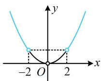

> [!faq]- 《第1节 原函数构造》参考答案
>
> > [!success]- **【答案】** A
>
> > [!note]- **【分析】**
> > 本题未单列分析。
>
> > [!note]- **【解析】**
> > 已知 $f(x)$ 是定义在 $(-∞,0)∪(0,+∞)$ 上的偶函数，若对任意的 $x∈(0,+∞)$ ，都有 $2f(x)+xf'(x)>0$ 成立，且 $f(2)=\frac{1}{2}$ ，则不等式 $f(x)-\frac{2}{x^{2}}>0$ 的解集为（）
> >
> > A. $(2,+∞)$ B. $(-2,0)∪(0,2)$ C. $(0,2)$ D. $(-∞,-2)∪(2,+∞)$
> >
> > 解析： $2f(x)+xf'(x)$ 中 $f(x)$ 的系数多了个2，不能构造 $xf(x)$ ，可乘以x化为 $2xf(x)+x^{2}f'(x)$ ，构造 $x^{2}f(x)$ ，设 $g(x)=x^{2}f(x)$ ，因为 $f(x)$ 为偶函数，所以 $g(x)$ 也为
> > 偶函数，且 $g'(x)=2xf(x)+x^{2}f'(x)=x[2f(x)+xf'(x)]$ ，由题意，当 $x\in(0,+\infty)$ 时， $2f(x)+xf'(x)>0$ ，所以 $g'(x)>0$ ，故 $g(x)$ 在 $(0,+\infty)$ 上↗，
> > 有了 $g(x)$ 的单调性，故将目标不等式往 $g(x)$ 化， $f(x)-\frac{2}{x^{2}}>0\Leftrightarrow x^{2}f(x)-2>0$ $\Leftrightarrow x^{2}f(x)>2\Leftrightarrow g(x)>2$ ①，
> > 又因为 $f(2)=\frac{1}{2}$ ，所以 $g(2)=4f(2)=2$ ，故不等式①等价于 $g(x)>g(2)$ ，要解此不等式，不妨画出 $g(x)$ 的草图来看，
> > 由 $g(x)$ 为偶函数且在 $(0,+\infty)$ 上↗可得 $g(x)$ 的草图如图，
> > 由图可知 $g(x)>g(2)\Leftrightarrow x\in(-\infty,-2)\cup(2,+\infty)$ .
> >
> > 
