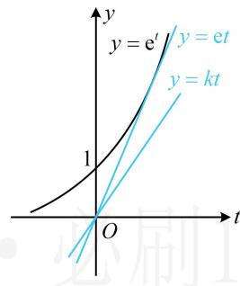

> [!faq]- 《第4节 同构》参考答案
>
> > [!success]- **【答案】** (0,e]
>
> > [!note]- **【分析】**
> > 本题未单列分析。
>
> > [!note]- **【解析】**
> > 解析：由题意， $h(x)\geq 0\Leftrightarrow x\mathrm{e}^{x + 1} - k(\ln x + x + 1)\geq 0$
> >
> > 若把 $x\mathrm{e}^{x + 1}$ 调整为 $\mathrm{e}^{\ln x + x + 1}$ ，则可将 $\ln x + x + 1$ 整体换元，
> >
> > 所以 $\mathrm{e}^{\ln x + x + 1} - k(\ln x + x + 1)\geq 0$ ，设 $t = \ln x + x + 1$
> >
> > 则 $t \in \mathbf{R}$ ，且 $\mathrm{e}^t - kt \geq 0$ ，所以 $\mathrm{e}^t \geq kt$ ，
> >
> > 如图，注意到 $y = \mathrm{e}^t$ 过原点的切线为 $y = \mathrm{e}t$ ，
> >
> > 所以当且仅当 $0 < k \leq \mathbf{e}$ 时， $\mathbf{e}^t \geq kt$ 恒成立.
> >
> > 
