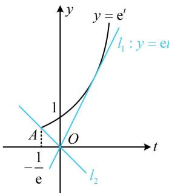

> [!faq]- 《第4节 同构》参考答案
>
> > [!success]- **【答案】** B
>
> > [!note]- **【分析】**
> > 本题未单列分析。
>
> > [!note]- **【解析】**
> > B
> >
> > 解析： $x^{x}$ 的底数和指数都有 $x$ ，不易直接分析，怎么办呢？可通过取对数把指数部分的 $x$ 拿下来，因为 $x^{x} = \mathrm{e}^{\ln x^{x}} = \mathrm{e}^{x\ln x}$ ，所以 $x^{x} - ax\ln x\geq 0\Leftrightarrow \mathrm{e}^{x\ln x} - ax\ln x$ $\geq 0$ ，含 $x$ 的部分为 $x\ln x$ 的整体结构，故换元，令 $t = x\ln x$ ，则 $\mathrm{e}^{x\ln x} - ax\ln x\geq 0$ 即为 $\mathrm{e}^t -at\geq 0$ ，既然换了元，就得研究新元的范围，可求导分析，因为 $t' = \ln x + 1$ ，所以 $t' > 0\Leftrightarrow x > \frac{1}{\mathrm{e}}$ ， $t' <   0\Leftrightarrow 0 <   x <   \frac{1}{\mathrm{e}}$ 从而 $t = x\ln x$ 在 $\left(0,\frac{1}{\mathrm{e}}\right)$ 上 $\searrow$ ，在 $\left(\frac{1}{\mathrm{e}}, + \infty\right)$ 上单调递增，故当 $x = \frac{1}{\mathrm{e}}$ 时， $t$ 取得最小值 $-\frac{1}{\mathrm{e}}$ ，即 $t\geq -\frac{1}{\mathrm{e}}$ 因为 $\mathrm{e}^t -at\geq 0$ ，所以 $\mathrm{e}^t\geq at$
> >
> > 函数 $y = \mathrm{e}^{t}$ 和 $y = at$ 都很简单，接下来作图分析最方便，
> >
> > 如图，要使 $\mathbf{e}^t\geq at$ 在 $\left[-\frac{1}{\mathrm{e}}, + \infty\right)$ 上恒成立，直线 $y = at$ 可从切线 $l_{1}$ 绕原点顺时针旋转至 $l_{2}$
> >
> > 切线 $l_{1}$ 的斜率为 $\mathbf{e}$ ，直线 $l_{2}$ 过原点和点 $A\left(-\frac{1}{\mathrm{e}}, \mathrm{e}^{-\frac{1}{\mathrm{e}}}\right)$ ，
> >
> > 其斜率为 $\frac{\mathrm{e}^{-\frac{1}{\mathrm{e}}}}{-\frac{1}{\mathrm{e}}} = -\mathrm{e}^{1 - \frac{1}{\mathrm{e}}}$ ，所以 $a$ 的取值范围为 $\left[-\mathrm{e}^{1 - \frac{1}{\mathrm{e}}},\mathrm{e}\right]$
> >
> > 
>
> > [!tip]- **【反思】**
> > 高中阶段，看到 $x^{x}(x > 0)$ 这一结构，常通过取对数将指数部分的 $x$ 拿下来，可将其调整为 $\mathrm{e}^{x\ln x}$
