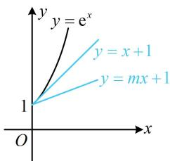

> [!faq]- 《第4节 同构》参考答案
>
> > [!success]- **【答案】** 1
>
> > [!note]- **【分析】**
> > 本题未单列分析。
>
> > [!note]- **【解析】**
> > 解析：左边是 $\ln(mx+1)$ ，所以将右侧的 mx 移至左侧，凑
> >
> > 成 $\ln (mx + 1) - (mx + 1)$ 这一典型结构，
> >
> > $$
> > \ln (m x + 1) - x - 1 > m x - \mathrm{e} ^ {x} \Leftrightarrow \ln (m x + 1) - (m x + 1) > x - \mathrm{e} ^ {x},
> > $$
> >
> > 接下来就是 $\ln x - x$ 与 $x - \mathrm{e}^{x}$ 的同构了，
> >
> > $$
> > \ln (m x + 1) - (m x + 1) > x - \mathrm{e} ^ {x} \Leftrightarrow \ln (m x + 1) - (m x + 1)
> > $$
> >
> > $$
> > > \ln \mathrm{e} ^ {x} - \mathrm{e} ^ {x} \quad ①,
> > $$
> >
> > 设 $f(x) = \ln x - x (x > 1)$ ，则不等式①即 $f(mx + 1) > f(\mathrm{e}^x)$ ，
> >
> > 因为 $f'(x) = \frac{1 - x}{x} < 0$ ，所以 $f(x)$ 在 $(1, +\infty)$ 上 $\searrow$ ，
> >
> > 因为 $m > 0$ ， $x > 0$ ，所以 $mx + 1 > 1$ ， $\mathrm{e}^x >1$
> >
> > 故 $f(mx + 1) > f(\mathrm{e}^x)\Leftrightarrow mx + 1 <   \mathrm{e}^x$ ，画图分析此不等式最方便，如图，注意到曲线 $y = \mathrm{e}^x$ 在(0,1)处的切线为 $y = x + 1$ 所以当且仅当 $0 <   m\leq 1$ 时， $mx + 1 <   \mathrm{e}^x$ 在 $(0, + \infty)$ 上恒成立，
> >
> > 故正实数 $m$ 的最大值为1.
> >
> > 
