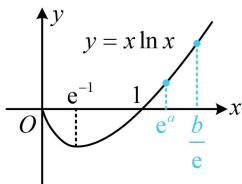

> [!faq]- 《第4节 同构》参考答案
>
> > [!success]- **【答案】** B
>
> > [!note]- **【分析】**
> > 本题未单列分析。
>
> > [!note]- **【解析】**
> > B
> > 解析：原不等式 $\Leftrightarrow ae^{a + 1} < b(\ln b - 1) \Leftrightarrow ae^{a + 1} < b\ln \frac{b}{e}$ ，此时可发现，只要两端同除以 $e$ ，就能转化为 $x e^x$ 和 $x \ln x$ 的同构模型， $ae^{a + 1} < b\ln \frac{b}{e} \Leftrightarrow ae^a < \frac{b}{e}\ln \frac{b}{e} \Leftrightarrow \ln e^a \cdot e^a < \frac{b}{e}\ln \frac{b}{e}$ ，左右两侧同构了，接下来可构造函数分析，设 $f(x) = x\ln x (x > 0)$ ，则 $f'(x) = 1 + \ln x$ ，所以 $f'(x) > 0 \Leftrightarrow x > e^{-1}$ ， $f'(x) < 0 \Leftrightarrow 0 < x < e^{-1}$ ，从而 $f(x)$ 在 $(0, e^{-1})$ 上 $\searrow$ ，在 $(e^{-1}, +\infty)$ 上 $\nearrow$ ，注意到当 $0 < x < 1$ 时， $f(x) < 0$ ，所以 $f(x)$ 的草图如图，不等式 $\ln e^a \cdot e^a < \frac{b}{e}\ln \frac{b}{e}$ 即为 $f(e^a) < f\left(\frac{b}{e}\right)$ ，注意到 $a > 0$ ，所以 $e^a > 1$ ，由图可知要使 $f(e^a) < f\left(\frac{b}{e}\right)$ ，只能 $e^a < \frac{b}{e}$ ，所以 $b > e^{a + 1}$ .
> >
> > 
