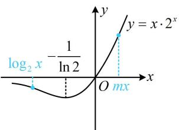
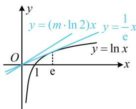

> [!faq]- 《第4节 同构》参考答案
>
> > [!success]- **【答案】** (2022·四川成都模拟·★★★★) 若不等式 $\log_2 x - m \cdot 2^{mx} \leq 0$ 对任意的 $x > 0$ 都成立，则正实数 $m$ 的取值范围为 \_\_\_\_. $$ \left[ \frac {1}{\mathrm{e} \ln 2}, + \infty\right) $$
>
> > [!note]- **【分析】**
> > 本题未单列分析。
>
> > [!note]- **【解析】**
> > 解析：指、对的底数是2，不是e，能同构吗？能，其实 $x\mathrm{e}^{x}$ 和 $x\ln x$ 的同构方法，也适用于其它底数的情形，所以我们先移项把指、对分开，再观察 $\log_{2}x$ 和 $m\cdot 2^{mx}$ 这两个部分，可发现同乘以 $x$ 就能转化为 $x\log_{2}x$ 和 $mx\cdot 2^{mx}$ ， $\log_{2}x - m\cdot 2^{mx}\leq 0\Leftrightarrow \log_{2}x\leq m\cdot 2^{mx}\Leftrightarrow x\log_{2}x\leq mx\cdot 2^{mx}$ $\Leftrightarrow 2^{\log_2x}\cdot \log_2x\leq mx\cdot 2^{mx}$ ①，此时左右两侧结构相同了，接下来构造函数研究单调性，
> >
> > 设 $f(x) = x \cdot 2^{x} (x \in \mathbb{R})$ ，则不等式①即为 $f(\log_{2} x) \leq f(mx)$ ，且 $f'(x) = 2^{x} + x \cdot 2^{x} \cdot \ln 2 = 2^{x} (1 + x \cdot \ln 2)$ ，所以 $f'(x) > 0 \Leftrightarrow x > -\frac{1}{\ln 2}$ ， $f'(x) < 0 \Leftrightarrow x < -\frac{1}{\ln 2}$ ，故 $f(x)$ 在 $\left(-\infty, -\frac{1}{\ln 2}\right)$ 上 $\searrow$ ，在 $\left(-\frac{1}{\ln 2}, +\infty\right)$ 上 $\nearrow$ ，又 $\lim_{x \to -\infty} f(x) = 0$ ， $\lim_{x \to +\infty} f(x) = +\infty$ ， $f(0) = 0$ ，所以 $f(x)$ 的大致图象如图1所示，因为 $m > 0$ ， $x > 0$ ，所以 $mx > 0$ ，故 $f(\log_{2} x) \leq f(mx) \Leftrightarrow \log_{2} x \leq mx$ ，接下来可以全分离，也可以换底后画图分析，下面我们把法1：将 $\log_{2} x \leq mx$ 全分离，求导研究最值， $\log_{2} x \leq mx \Leftrightarrow m \geq \frac{\log_{2} x}{x}$ ，设 $\varphi(x) = \frac{\log_{2} x}{x} (x > 0)$ ，则 $\varphi'(x) = \frac{\frac{1}{x \ln 2} \cdot x - \log_{2} x}{x^{2}} = \frac{\frac{1}{\ln 2} - \log_{2} x}{x^{2}} = \frac{\log_{2} e - \log_{2} x}{x^{2}}$ ，所以 $\varphi'(x) > 0 \Leftrightarrow 0 < x < e$ ， $\varphi'(x) < 0 \Leftrightarrow x > e$ ，从而 $\varphi(x)$ 在 $(0, e)$ 上 $\nearrow$ ，在 $(e, +\infty)$ 上 $\searrow$ ，故 $\varphi(x)_{\max} = \varphi(e) = \frac{\log_{2} e}{e} = \frac{1}{e \ln 2}$ ，因为 $m \geq \varphi(x)$ 恒成立，所以 $m \geq \frac{1}{e \ln 2}$ 。法2：也可通过换底公式，化为 $\ln x$ ，画图求参数范围，因为 $\log_{2} x = \frac{\ln x}{\ln 2}$ ，所以 $\log_{2} x \leq mx \Leftrightarrow \frac{\ln x}{\ln 2} \leq mx$ $\Leftrightarrow \ln x \leq (m \cdot \ln 2)x$ ②，如图2，注意到 $y = \ln x$ 过原点的切线为 $y = \frac{1}{e} x$ 所以要使不等式②恒成立，应有 $m \geq \frac{1}{e \ln 2}$ 。
> >
> >   
> > 图1
> >
> >   
> > 图2
