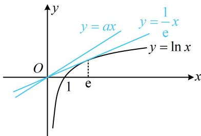

> [!faq]- 《第4节 同构》例题解析
>
> > [!success]- **【答案】** B
>
> > [!note]- **【分析】**
> > 本题未单列分析。
>
> > [!note]- **【解析】**
> > 解析：不等式两端有些相似，考虑通过同构将其化简，要同构，先把含 $a$ 的和不含 $a$ 的分离到两端， $\mathrm{e}^{ax} + \mathrm{e}^{-\ln x} - \sin (\ln x) > \mathrm{e}^{-ax} + \mathrm{e}^{\ln x} - \sin (ax) \Leftrightarrow \mathrm{e}^{ax} - \mathrm{e}^{-ax} + \sin (ax) > \mathrm{e}^{\ln x} - \mathrm{e}^{-\ln x} + \sin (\ln x)$ ①，此时左右两侧已同构，可构造函数分析，设 $f(x) = \mathrm{e}^x - \mathrm{e}^{-x} + \sin x (x \in \mathbf{R})$ ，则式①即为 $f(ax) > f(\ln x)$ ，因为 $f'(x) = \mathrm{e}^x + \mathrm{e}^{-x} + \cos x \geq 2\sqrt{\mathrm{e}^x \cdot \mathrm{e}^{-x}} + \cos x = 2 + \cos x > 0$ ，所以 $f(x)$ 在 $\mathbf{R}$ 上 $\nearrow$ ，故 $ax > \ln x$ 怎样由 $ax > \ln x$ 求 $a$ 的范围？先分离出 $a$ ，再研究最值可行，但画图结合经典切线分析更方便，
> >
> > 如图，注意到 $y = \ln x$ 过原点的切线方程为 $y = \frac{1}{\mathrm{e}}x$ ，所以当且仅当 $a > \frac{1}{\mathrm{e}}$ 时， $ax > \ln x$ 恒成立.
> >
> >
> > 
>
> > [!tip]- **【反思】**
> > 同构需要较强的观察能力和代数变形的基本功，操作的方法之一是将参数集中到等式或不等式的一侧，再调整结构.
