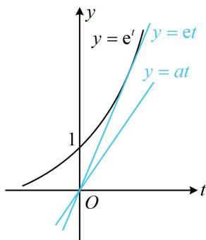

> [!faq]- 《第4节 同构》例题解析
>
> > [!success]- **【答案】** A
>
> > [!note]- **【分析】**
> > 本题未单列分析。
>
> > [!note]- **【解析】**
> > 解析：若将 $x\mathrm{e}^x$ 调整为 $\mathrm{e}^{\ln x + x}$ ，则含 $x$ 的部分都以 $x + \ln x$ 这一整体结构出现，可换元简化不等式，
> >
> > $$
> > f (x) = x \mathrm{e} ^ {x} - a (x + \ln x) = \mathrm{e} ^ {\ln x} \cdot \mathrm{e} ^ {x} - a (x + \ln x) = \mathrm{e} ^ {\ln x + x} - a (x + \ln x)
> > $$
> >
> > 设 $t = x + \ln x$ ，则 $t\in \mathbf{R}$ ，且 $f(x) = \mathrm{e}^t -at$ ，所以 $f(x)\geq 0$ 即为 $\mathrm{e}^t -at\geq 0$ ，故 $\mathrm{e}^t\geq at$ 若要由 $\mathrm{e}^t\geq at$ 分离出 $a$ ，则需讨论 $t$ 的正负，比较麻烦，画图结合经典切线来分析更简单，如图，函数 $y = \mathrm{e}^t$ 过原点的切线为 $y = \mathrm{e}t$ 所以当且仅当 $0\leq a\leq \mathrm{e}$ 时， $\mathbf{e}^t\geq at$ 恒成立.答案：A
> >
> > 
>
> > [!tip]- **【反思】**
> > - **①**：从例2可以看出，通过恒等式 $x = \mathrm{e}^{\ln x}(x > 0)$ 可将 $u(x)\mathrm{e}^{v(x)}(u(x) > 0)$ 化为 $\mathrm{e}^{\ln u(x) + v(x)}$ ，若某等式或不等式的其余部分恰好也是 $\ln u(x) + v(x)$ 这种整体结构，就能换元简化处理；
> > - **②**：若将本题的函数解析式改为 $f(x) = x^{2}\mathrm{e}^{x} - a(x + 2\ln x)$ ，其余不变，你会做吗？一样地，将 $x^{2}\mathrm{e}^{x}$ 化为 $\mathrm{e}^{x + 2\ln x}$ 即可.
