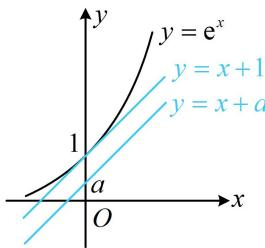

> [!faq]- 《第4节 同构》例题解析
>
> > [!success]- **【答案】** 1
>
> > [!note]- **【分析】**
> > 本题未单列分析。
>
> > [!note]- **【解析】**
> > 解析：观察发现参数 $a$ 不易分离，也无法像例2那样化整体结构换元，怎么办呢？注意到有 $\ln (x + a)$ ，故先两端同时加 $x$ ，将右侧统一成 $x + a$ ，就会发现可按 $\mathrm{e}^x + x$ 与 $x + \ln x$ 的同构方法来处理，
> >
> > $$
> > \mathrm{e} ^ {x} \geq \ln (x + a) + a \Leftrightarrow \mathrm{e} ^ {x} + x \geq \ln (x + a) + (x + a) \Leftrightarrow \mathrm{e} ^ {x} + \ln \mathrm{e} ^ {x} \geq \ln (x + a) + (x + a) \tag {①}
> > $$
> >
> > 设 $f(x) = \ln x + x (x > 0)$ ，则 $f'(x) = \frac{1}{x} + 1 > 0$ ，所以 $f(x)$ 在 $(0, +\infty)$ 上 $\nearrow$ ，不等式①即为 $f(\mathrm{e}^x) \geq f(x + a)$ ，所以 $\mathrm{e}^x \geq x + a$ ，
> >
> > 接下来化为 $a \leq \mathrm{e}^x - x$ ，再研究右侧的最小值可行，但画图分析更简单，如图， $y = \mathrm{e}^x$ 的斜率为 1 的切线是 $y = x + 1$ ，
> >
> > 所以要使 $\mathrm{e}^x \geq x + a$ 恒成立，应有 $a \leq 1$ ，故 $a$ 的最大值为 1.
> >
> > 
>
> > [!tip]- **【反思】**
> > - **①**：基础模型 $\mathrm{e}^x\pm x$ 与 $x\pm \ln x$ 之间的同构务必熟悉；
> > - **②**：本题对 $\mathrm{e}^x +x\geq \ln (x + a) + (x + a)$ 的同构，也可化为左边的形式，即变形成 $\mathrm{e}^x +x\geq \ln (x + a) + \mathrm{e}^{\ln (x + a)}$ ，构造函数 $g(x) = \mathrm{e}^x +x$ 来分析.
