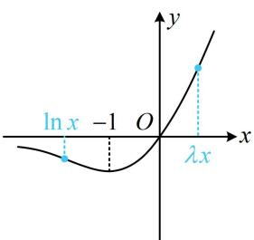
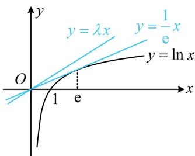

> [!faq]- 《第4节 同构》例题解析
>
> > [!success]- **【答案】** $\frac{1}{\mathrm{e}}$
>
> > [!note]- **【分析】**
> > 本题未单列分析。
>
> > [!note]- **【解析】**
> > 解析：看到 $\lambda e^{\lambda x}$ 这一结构，想到乘以 $x$ 将前面的系数 $\lambda$ 调整为与指数部分一致，
> >
> > $\lambda \mathrm{e}^{\lambda x} - \ln x\geq 0\Leftrightarrow \lambda \mathrm{e}^{\lambda x}\geq \ln x\Leftrightarrow \lambda x\mathrm{e}^{\lambda x}\geq x\ln x$ ，这样问题就转化成了 $x\mathrm{e}^x$ 与 $x\ln x$ 的基本同构模型，
> >
> > $$
> > \lambda x \mathrm{e} ^ {\lambda x} \geq x \ln x \Leftrightarrow \lambda x \mathrm{e} ^ {\lambda x} \geq \mathrm{e} ^ {\ln x} \cdot \ln x \tag {①}
> > $$
> >
> > $$
> > f (x) = x \mathrm{e} ^ {x} (x \in \mathbf {R})
> > $$
> >
> > $$
> > f ^ {\prime} (x) = (x + 1) \mathrm{e} ^ {x}
> > $$
> >
> > $$
> > f ^ {\prime} (x) > 0 \Leftrightarrow x > - 1, f ^ {\prime} (x) <   0 \Leftrightarrow x <   - 1
> > $$
> >
> > $$
> > (- \infty , - 1) \text {上} \searrow
> > $$
> >
> > $$
> > (- 1, + \infty) \text {上} \nearrow
> > $$
> >
> > 又 $\lim_{x\to -\infty}f(x) = 0$ ， $f(-1) = -\frac{1}{\mathsf{e}}$ ， $\lim_{x\to +\infty}f(x) = +\infty$ ， $f(0) = 0$ ，所以 $f(x)$ 的大致图象如图1，
> >
> > 不等式①即为 $f(\lambda x) \geq f(\ln x)$ ，由题意， $\lambda x > 0$ ，所以 $f(\lambda x) \geq f(\ln x) \Leftrightarrow \lambda x \geq \ln x$ ，
> >
> > 这一不等式的处理可以全分离成 $\lambda \geq \frac{\ln x}{x}$ ，对右侧求导研究最值，但更简单的做法是画图分析，如图2，注意到 $y = \ln x$ 过原点的切线为 $y = \frac{1}{\mathrm{e}} x$ 所以要使 $\lambda x \geq \ln x$ 恒成立，应有 $\lambda \geq \frac{1}{\mathrm{e}}$ 故 $\lambda_{\min} = \frac{1}{\mathrm{e}}$
> >
> >
> > 
> >
> >   
> > 图1  
> > 图2
>
> > [!tip]- **【反思】**
> > 例3和变式1凑同构的操作不同，一个是加 $x$ ，一个是乘以 $x$ ，但在原不等式中都有线索，比如例3的 $\ln (x + a) + a$ ，变式1的 $\lambda \mathrm{e}^{\lambda x}$ ，这些都提示了我们应该如何去凑出像 $\ln x + x$ ， $x\mathrm{e}^{x}$ 这些基本结构.
