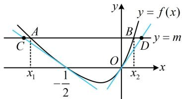

> [!faq]- 《第1节 隐零点、零点讨论、切割线放缩》参考答案
>
> > [!success]- **【答案】** 详见解析
>
> > [!note]- **【分析】**
> > 本题未单列分析。
>
> > [!note]- **【解析】**
> > 由题意， $f'(x) = e^{2x} - a + (x + b) \cdot 2e^{2x} = (2x + 2b + 1)e^{2x} - a$ ，
> > 所以 $f'\left(-\frac{1}{2}\right) = \frac{2b}{e} - a$ ，
> > 所给切线方程 $(e-1)x + ey + \frac{e-1}{2} = 0$ 可化为 $y = \frac{1-e}{e}x + \frac{1-e}{2e}$ ，其斜率为 $\frac{1-e}{e}$ ，故 $\frac{2b}{e} - a = \frac{1-e}{e}$ ①，
> > 将 $x = -\frac{1}{2}$ 代入 $y = \frac{1-e}{e}x + \frac{1-e}{2e}$ 可得 $y = 0$ ，
> > 又 $f\left(-\frac{1}{2}\right) = \left(b - \frac{1}{2}\right)\left(\frac{1}{e} - a\right)$ ，所以 $\left(b - \frac{1}{2}\right)\left(\frac{1}{e} - a\right) = 0$ ②，
> > 由②可得 $b = \frac{1}{2}$ 或 $a = \frac{1}{e}$ ，若 $a = \frac{1}{e}$ ，则代入①可得 $b = 1 - \frac{e}{2} < 0$ ，不合题意，
> > 所以只能 $b = \frac{1}{2}$ ，代入①得 $a = 1$ 。
> > （2）由（1）可得 $f(x) = \left(x + \frac{1}{2}\right)(e^{2x} - 1)$ ，令 $f(x) = 0$ 可得 $x = -\frac{1}{2}$ 或 $0$ ，
> > 所以 $f(x)$ 的图象与 $x$ 轴负半轴的交点为 $P\left(-\frac{1}{2}, 0\right)$ ，由（1）可得 $h(x) = \frac{1-e}{e}x + \frac{1-e}{2e}$ ，因为 $F(x) = f(x) - h(x)$ ，所以 $F'(x) = f'(x) - h'(x) = (2x + 2)e^{2x} - 1 - \frac{1-e}{e} = (2x + 2)e^{2x} - \frac{1}{e}$ ，
> >
> > （上式虽较复杂，但观察发现 $F'\left(-\frac{1}{2}\right)=0$ ，所以可尝试判断 $F'(x)$ 在 $-\frac{1}{2}$ 两侧的正负）
> >
> > 当 $x < -\frac{1}{2}$ 时， $2x + 2 < 1$ ， $0 < \mathrm{e}^{2x} < \frac{1}{\mathrm{e}}$
> >
> > 所以 $(2x + 2)\mathrm{e}^{2x} <   \frac{1}{\mathrm{e}}$ ，故 $F^{\prime}(x) <   0$
> >
> > 当 $x > -\frac{1}{2}$ 时， $2x + 2 > 1$ ， $\mathrm{e}^{2x} > \frac{1}{\mathrm{e}}$
> >
> > 所以 $(2x + 2)\mathrm{e}^{2x} > \frac{1}{\mathrm{e}}$ ，故 $F^{\prime}(x) > 0$
> >
> > 所以 $F(x)$ 在 $\left(-\infty, -\frac{1}{2}\right)$ 单调递减，在 $\left(-\frac{1}{2}, +\infty\right)$ 单调递增，
> >
> > 故 $F(x)_{\min} = F\left(-\frac{1}{2}\right) = f\left(-\frac{1}{2}\right) - h\left(-\frac{1}{2}\right) = 0.$
> >
> > (3) (要证的不等式有三个变量, 常规的想法是消元, 但经尝试, 由 $f(x_{1}) = f(x_{2}) = m$ 不易统一变量, 怎么办呢? 不妨从图形上找思路. $f(x)$ 有 $-\frac{1}{2}$ 和 0 两个零点, 且第 (2) 问已证 $x = -\frac{1}{2}$ 处的切线在 $f(x)$ 图象下方, 受此启发, 我们猜想 $x = 0$ 处的切线也在下方, 如图, 可发现 $x_{2} - x_{1}$ 即为图中的 $|AB|$ , 而由图还可看出 $|AB| \leq |CD|$ , 于是我们猜想 $|CD|$ 会不会恰好等于目标不等式的右侧, 思路就出来了. 容易求得 $x = 0$ 处的切线方程为 $y = x$ , 下面先证明该切线在 $f(x)$ 图象的下方)
> >
> > 
> >
> > 设 $g(x) = f(x) - x$ ，则 $g^{\prime}(x) = f^{\prime}(x) - 1 = (2x + 2)\mathrm{e}^{2x} - 2$
> >
> > （观察发现 $g^{\prime}(0) = 0$ ，故尝试分析 $g^{\prime}(x)$ 在0的左右两侧的正负）当 $x < 0$ 时， $2x + 2 < 2$ ， $0 < \mathrm{e}^{2x} < 1$
> >
> > 所以 $(2x + 2)\mathrm{e}^{2x} < 2$ ，故 $g^{\prime}(x) < 0$
> >
> > 当 $x > 0$ 时， $2x + 2 > 2$ ， $\mathrm{e}^{2x} > 1$
> >
> > 所以 $(2x + 2)\mathrm{e}^{2x} > 2$ ，故 $g^{\prime}(x) > 0$
> >
> > 所以 $g(x)$ 在 $(-\infty,0)$ 单调递减，在 $(0, + \infty)$ 单调递增，
> >
> > 故 $g(x)\geq g(0) = f(0) - 0 = 0$
> >
> > 所以 $f(x) - x\geq 0$ ，故 $f(x)\geq x$ ③，
> >
> > 由（2）可得 $F(x) = f(x) - h(x)\geq 0$ ，所以 $f(x)\geq h(x)$
> >
> > 故 $f(x)\geq \frac{1 - \mathrm{e}}{\mathrm{e}} x + \frac{1 - \mathrm{e}}{2\mathrm{e}}$ ④，
> >
> > （由上图知可将要证的不等式拆分成 $x_{2} \leq x_{D}$ 和 $x_{1} \geq x_{C}$ 来证，故在③④中分别取 $x = x_{2}$ ， $x = x_{1}$ ）
> >
> > 由题意， $x_{1}$ ， $x_{2}$ 是 $f(x)=m$ 的两根，
> >
> > 所以 $f(x_{1}) = f(x_{2}) = m$ ，在③中取 $x = x_{2}$ 得 $f(x_{2})\geq x_{2}$
> >
> > 结合 $f(x_{2}) = m$ 可得 $x_{2}\leq m$ ⑤，
> >
> > 在④中取 $x = x_{1}$ 得 $f(x_{1})\geq \frac{1 - \mathrm{e}}{\mathrm{e}} x_{1} + \frac{1 - \mathrm{e}}{2\mathrm{e}},$
> >
> > 结合 $f(x_{1}) = m$ 可得 $m\geq \frac{1 - \mathrm{e}}{\mathrm{e}} x_1 + \frac{1 - \mathrm{e}}{2\mathrm{e}},$
> >
> > 所以 $\frac{1 - \mathrm{e}}{\mathrm{e}} x_1 \leq m - \frac{1 - \mathrm{e}}{2\mathrm{e}}$ ，从而 $x_1 \geq \frac{me}{1 - \mathrm{e}} - \frac{1}{2}$ ，
> >
> > 故 $-x_{1} \leq -\frac{me}{1 - e} + \frac{1}{2}$ ⑥,
> >
> > 将⑤⑥相加可得 $x_{2} - x_{1}\leq m - \frac{me}{1 - e} +\frac{1}{2} = \frac{1 + 2m}{2} -\frac{me}{1 - e}.$
