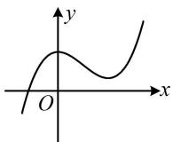
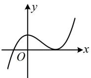
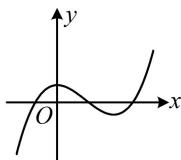
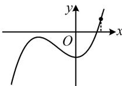

> [!faq]- 《第1节 隐零点、零点讨论、切割线放缩》参考答案
>
> > [!success]- **【答案】** 详见解析
>
> > [!note]- **【分析】**
> > 本题未单列分析。
>
> > [!note]- **【解析】**
> > 解：（1）由题意， $f'(x) = \mathrm{e}^x + (x - 1)\mathrm{e}^x - 2ax$ $= x\mathrm{e}^x - 2ax = x(\mathrm{e}^x - 2a)$ ，（由 $f'(x) = 0$ 可得 $x = 0$ 或 $\ln(2a)$ ，其中 $\ln(2a)$ 是否有意义由 $a$ 的正负决定。当 $a \leq 0$ 时， $\mathrm{e}^x - 2a > 0$ ，所以 $f'(x) > 0 \Leftrightarrow x > 0$ ， $f'(x) < 0 \Leftrightarrow x < 0$ ，
> >
> > 故 $f(x)$ 在 $(-\infty, 0)$ 上单调递减，在 $(0, +\infty)$ 上单调递增；
> >
> > （当 $a > 0$ 时， $f'(x)$ 有 $0$ 和 $\ln(2a)$ 两个零点，故又讨论它们的大小，即讨论 $a$ 与 $\frac{1}{2}$ 的大小）
> >
> > 当 $0 < a < \frac{1}{2}$ 时， $\ln(2a) < 0$ ，若 $x < \ln(2a)$ ，则 $x < 0$ ，
> >
> > 且 $\mathrm{e}^x - 2a < \mathrm{e}^{\ln(2a)} - 2a = 2a - 2a = 0$ ，所以 $f'(x) > 0$ ，
> >
> > 若 $\ln(2a) < x < 0$ ，则 $\mathrm{e}^x - 2a > \mathrm{e}^{\ln(2a)} - 2a = 2a - 2a = 0$ ，
> >
> > 所以 $f'(x) < 0$ ，
> >
> > 若 $x > 0$ ，则 $\mathrm{e}^x - 2a > \mathrm{e}^0 - 2a = 1 - 2a > 0$ ，
> >
> > 所以 $f'(x) > 0$ ，故 $f(x)$ 在 $(-\infty, \ln(2a))$ 上单调递增，在 $(\ln(2a), 0)$ 上单调递减，在 $(0, +\infty)$ 上单调递增；
> >
> > 当 $a = \frac{1}{2}$ 时， $f'(x) = x(\mathrm{e}^x - 1)$ ，若 $x < 0$ ，则 $\mathrm{e}^x - 1 < 0$ ，
> >
> > 所以 $f'(x) > 0$ ，若 $x > 0$ ，则 $\mathrm{e}^x - 1 > 0$ ，所以 $f'(x) > 0$ ，
> >
> > 结合 $f'(0) = 0$ 得 $f'(x) \geq 0$ 恒成立，
> >
> > 当且仅当 $x = 0$ 时取等号，故 $f(x)$ 在 $R$ 上单调递增；
> >
> > 当 $a > \frac{1}{2}$ 时， $\ln(2a) > 0$ ，若 $x < 0$ ，则 $\mathrm{e}^x - 2a < \mathrm{e}^0 - 2a = 1 - 2a < 0$ ，所以 $f'(x) > 0$ ，
> >
> > 若 $0 < x < \ln(2a)$ ，则 $\mathrm{e}^x - 2a < \mathrm{e}^{\ln(2a)} - 2a = 2a - 2a = 0$ ，
> >
> > 所以 $f'(x) < 0$ ，
> >
> > 若 $x > \ln(2a)$ ，则 $x > 0$ ，且 $\mathrm{e}^x - 2a > \mathrm{e}^{\ln(2a)} - 2a = 2a - 2a = 0$ ，所以 $f'(x) > 0$ ，
> >
> > 故 $f(x)$ 在 $(-\infty, 0)$ 上单调递增，在 $(0, \ln(2a))$ 上单调递减，在 $(\ln(2a), +\infty)$ 上单调递增。
> >
> > （2）解法1：选①，则 $\frac{1}{2} < a ≤ \frac{\mathrm{e}^2}{2}$ ，且 $b > 2a$ ，
> >
> > 所以 $0 < \ln(2a) ≤ 2$ ，由（1）知 $f(x)$ 在 $(-\infty, 0)$ 上单调递增，在 $(0, \ln(2a))$ 上单调递减，在 $(\ln(2a), +\infty)$ 上单调递增，
> >
> > (分析可得当 $x \to -\infty$ 时， $f(x) \to -\infty$ ，结合 $f(0) = b - 1 >$
> >
> > $2a - 1 > 0$ 得 $f(x)$ 在 $(- \infty, 0)$ 上有 1 个零点，但作答时需在 $(- \infty, 0)$ 上取出使 $f(x) < 0$ 的点，结合零点存在定理来论证，观察 $f(x)$ 的解析式，我们发现在 $(- \infty, 0)$ 上， $(x - 1)e^{x} < 0$ ，所以我们取出来的点只要满足余下的部分 $-ax^2 + b$ 为 0 就行，故可取 $-\sqrt{\frac{b}{a}}$ ）因为 $f\left(-\sqrt{\frac{b}{a}}\right) = \left(-\sqrt{\frac{b}{a}} - 1\right)e^{-\sqrt{\frac{b}{a}}} - a\left(-\sqrt{\frac{b}{a}}\right)^2 + b$
> >
> > $= \left(-\sqrt{\frac{b}{a}} -1\right)\mathrm{e}^{-\sqrt{\frac{b}{a}}} <   0,\quad f(0) = b - 1 > 2a - 1 > 0,$
> >
> > 所以 $f(x)$ 在 $\left(-\sqrt{\frac{b}{a}},0\right)$ 上有1个零点，结合 $f(x)$ 在 $(-\infty ,0)$ 单调递增知 $f(x)$ 在 $(-\infty ,0)$ 有且仅有1个零点，
> >
> > （再看 $(0, +\infty)$ 的情况，这段上 $f(x)$ 先 $\searrow$ 后 $\nearrow$ ，且当 $x \to +\infty$ 时， $f(x) \to +\infty$ ，所以极小值 $f(\ln(2a))$ 的正负决定零点个数，有如图1、图2、图3所示的三种情况，故接下来算极小值）
> >
> >   
> > 图1
> >
> >   
> > 图2
> >
> >   
> > 图3
> >
> > 由 $b > 2a$ 得 $f(\ln (2a)) = [\ln (2a) - 1]\mathrm{e}^{\ln (2a)} - a\ln^2 (2a) + b$
> >
> > $$
> > = 2 a [ \ln (2 a) - 1 ] - a \ln^ {2} (2 a) + b
> > $$
> >
> > $$
> > > 2 a [ \ln (2 a) - 1 ] - a \ln^ {2} (2 a) + 2 a = a \ln (2 a) [ 2 - \ln (2 a) ] \geq 0
> > $$
> >
> > 所以 $f(x)$ 在 $(0, +\infty)$ 上没有零点，
> >
> > 综上所述， $f(x)$ 有且仅有一个零点.
> >
> > 解法2：选②，则 $0 < a < \frac{1}{2}$ ， $b \leq 2a$ ，所以 $\ln (2a) < 0$ ，
> >
> > 由（1）知 $f(x)$ 在 $(- \infty, \ln(2a))$ 上单调递增，在 $(\ln(2a), 0)$ 上单调递减，在 $(0, +\infty)$ 上单调递增，
> >
> > (在 $(-∞,0)$ 上， $f(x)$ 的零点个数由极大值 $f(\ln(2a))$ 的正负决定，故先算它)
> >
> > 因为 $b \leq 2a$ ，所以 $f(\ln (2a)) = [\ln (2a) - 1]\mathrm{e}^{\ln (2a)} - a\ln^2 (2a) +$
> >
> > $$
> > b = 2 a [ \ln (2 a) - 1 ] - a \ln^ {2} (2 a) + b
> > $$
> >
> > $$
> > \leq 2 a [ \ln (2 a) - 1 ] - a \ln^ {2} (2 a) + 2 a = a \ln (2 a) [ 2 - \ln (2 a) ] <   0,
> > $$
> >
> > 所以 $f(x)$ 在 $(- \infty, 0)$ 上没有零点，且由 $f(\ln(2a)) < 0$ 和
> >
> > $f(x)$ 在 $(\ln (2a),0)$ 上单调递减可得 $f(0) = b - 1 <   0$
> >
> > （到此结合当 $x \to +\infty$ 时， $f(x) \to +\infty$ ，我们可以想象 $f(x)$ 的大致图象如图4， $f(x)$ 的唯一零点在 $(0, +\infty)$ 上，但要严格论证，需在 $(0, +\infty)$ 上取出能使 $f(x) > 0$ 的点。直接取点不易，考虑通过放缩将解析式化简再取，解析式中有 $\mathrm{e}^x$ ，可尝试用经典切线放缩不等式 $\mathrm{e}^x \geq x + 1$ 来放缩，且为了使 $f(x)$ 解析式中与 $\mathrm{e}^x$ 相乘的部分为正，我们考虑 $x > 1$ 的情形。下面先证明此不等式）
> >
> >   
> > 图4
> >
> > 设 $u(x) = \mathrm{e}^{x} - x - 1$ ，其中 $x > 1$ ，则 $u^{\prime}(x) = \mathrm{e}^{x} - 1 > 0$
> >
> > 所以 $u(x)$ 在 $(1, +\infty)$ 上单调递增，故 $u(x) > u(1) = \mathrm{e} - 2 > 0$
> >
> > 所以当 $x > 1$ 时， $\mathrm{e}^x >x + 1$ ，故 $f(x) = (x - 1)\mathrm{e}^x -ax^2 +b$
> >
> > $$
> > > (x - 1) (x + 1) - a x ^ {2} + b = (1 - a) x ^ {2} + b - 1 \quad (\mathrm{i}),
> > $$
> >
> > （观察发现只要在上述不等式中令 $x = \sqrt{\frac{1 - b}{1 - a}}$ ，则右侧恰好为0， $f(x) > 0$ 的点就取出来了，但 $\sqrt{\frac{1 - b}{1 - a}}$ 不一定大于1，所以不能直接取 $\sqrt{\frac{1 - b}{1 - a}}$ ，怎么办呢？从图象来看，我们取的点可以往 $+\infty$ 去，故不妨取一个比 $\sqrt{\frac{1 - b}{1 - a}}$ 和1都大的点）取 $x_0 > \max \left\{\sqrt{\frac{1 - b}{1 - a}}, 1\right\}$ ，则由(i)可得 $f(x_0) > (1 - a)x_0^2 + b - 1 > (1 - a)\left(\sqrt{\frac{1 - b}{1 - a}}\right)^2 + b - 1 = 0$ ，结合 $f(0) < 0$ 和 $f(x)$ 在 $(0, +\infty)$ 上单调递增可得 $f(x)$ 在
> >
> > $(0, + \infty)$ 上有1个零点，
> >
> > 综上所述， $f(x)$ 有且仅有一个零点.
> >
> > 一数·必刷100讲
