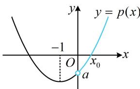

<!-- question-source:start -->
【变式】已知函数 $f(x) = 2\ln x - \frac{4}{x} - \frac{a}{x^2} - 2$ .

(1) 当 a = -3 时，求 $f(x)$ 的极值；

(2) 若函数 $f(x)$ 有唯一的极值点 $x_0$ .

（i）求实数 $a$ 的取值范围；（ii）证明： $x_0^2 f(x_0) + 2x_0^2\mathrm{e}^{1 - x_0} + 1\geq 0$

（1）当 $a = -3$ 时， $f(x) = 2\ln x - \frac{4}{x} + \frac{3}{x^2} - 2, x > 0$ ，所以 $f'(x) = \frac{2}{x} + \frac{4}{x^2} - \frac{6}{x^3} = \frac{2x^2 + 4x - 6}{x^3} = \frac{2(x + 3)(x - 1)}{x^3}$ ，从而 $f'(x) < 0 \Leftrightarrow 0 < x < 1$ ， $f'(x) > 0 \Leftrightarrow x > 1$ ，故 $f(x)$ 在 $(0,1)$ 上单调递减，在 $(1,+\infty)$ 上单调递增，

所以 $f(x)$ 有极小值 $f
(1) = 2\ln 1 - \frac{4}{1} +\frac{3}{1^2} -2 = -3$ ，无极大值.

(2) (i) (研究 $f(x)$ 的极值点, 考虑直接对 $f(x)$ 求导分析)

由题意， $f^{\prime}(x) = \frac{2}{x} +\frac{4}{x^{2}} +\frac{2a}{x^{3}} = \frac{2(x^{2} + 2x + a)}{x^{3}},\quad x > 0,$

(观察发现 $f'(x)$ 的正负由 $x^{2} + 2x + a$ 决定, 这部分可看成二次函数, 其开口向上,

对称轴为 $x = -1$ ，如图，要使 $f(x)$ 有唯一的极值点，应有 $a < 0$ ，于是我们就分 $a \geq 0$ 和 $a < 0$ 两种情况讨论）当 $a \geq 0$ 时， $f'(x) > 0$ ，所以 $f(x)$ 在 $(0, +\infty)$ 上单调递增，故 $f(x)$ 没有极值点，不合题意；

当 $a < 0$ 时，记 $p(x) = x^2 + 2x + a$ ，则 $p(x)$ 在 $(0, +\infty)$ 上单调递增，

又 $p(0) = a < 0$ ， $p\left(-\frac{a}{2}\right) = \left(-\frac{a}{2}\right)^2 + 2\left(-\frac{a}{2}\right) + a = \frac{a^2}{4} > 0$ ，所以 $p(x)$ 在 $\left(0, -\frac{a}{2}\right)$ 上有唯一的零点 $x_0$

当 $x \in (0, x_0)$ 时， $p(x) < 0$ ，所以 $f'(x) < 0$ ， $f(x)$ 单调递减，

当 $x \in (x_0, +\infty)$ 时， $p(x) > 0$ ，所以 $f'(x) > 0$ ， $f(x)$ 单调递增，

从而 $f(x)$ 有唯一的极值点 $x_0$ ，故实数 $a$ 的取值范围是 $(- \infty, 0)$ .

(ii) 要证 $x_0^2 f(x_0) + 2x_0^2\mathrm{e}^{1 - x_0} + 1 \geq 0$ ，即证 $2x_0^2 \ln x_0 - 4x_0 - a - 2x_0^2 + 2x_0^2\mathrm{e}^{1 - x_0} + 1 \geq 0$

也即证 $2x_0^2\ln x_0 - 4x_0 - 2x_0^2 + 2x_0^2\mathrm{e}^{1 - x_0} - a + 1 \geq 0$ ①,

（该不等式中既有 $x_0$ ，又有 $a$ ，不好处理，考虑消元．这里 $x_0$ 和 $a$ 不是无关的，它们要满足 $p(x_0) = 0$ ，故可由此消元）因为 $p(x_0) = x_0^2 + 2x_0 + a = 0$ ，所以 $a = -x_0^2 - 2x_0$

代入①知要证结论成立，只需证 $2x_0^2\ln x_0 - 2x_0 - x_0^2 + 2x_0^2\mathrm{e}^{1 - x_0} + 1 \geq 0$ ，即证 $\ln x_0 - \frac{1}{x_0} - \frac{1}{2} + \mathrm{e}^{1 - x_0} + \frac{1}{2x_0^2} \geq 0$ ②，（只有 $x_0$ 一个变量了，可尝试将 $x_0$ 看成自变量，构造函数求导分析）令 $g(x) = \ln x - \frac{1}{x} - \frac{1}{2} + \mathrm{e}^{1 - x} + \frac{1}{2x^2}$ ， $x > 0$ ，则 $g'(x) = \frac{1}{x} + \frac{1}{x^2} - \mathrm{e}^{1 - x} - \frac{1}{x^3} = \frac{x^2 + x - 1}{x^3} - \mathrm{e}^{1 - x} = \mathrm{e}^{1 - x}\left(\frac{x^2 + x - 1}{x^3}\mathrm{e}^{x - 1} - 1\right)$ ，（经尝试，无法直接判断 $g'(x)$ 的正负，考虑继续求导，直接求导显然比较复杂，观察发现 $g'(x)$ 的正负只由 $\frac{x^2 + x - 1}{x^3}\mathrm{e}^{x - 1} - 1$ 决定，故只需把这部分单独拿出来求导分析）设 $h(x) = \frac{x^2 + x - 1}{x^3}\mathrm{e}^{x - 1} - 1$ ， $x > 0$ ，则 $h'(x) = \frac{(2x + 1)x^3 - 3x^2(x^2 + x - 1)}{x^6}\mathrm{e}^{x - 1} + \frac{x^2 + x - 1}{x^3}\mathrm{e}^{x - 1} = \frac{x^3 - 3x + 3}{x^4}\mathrm{e}^{x - 1}$ ，（上式能直接判断正负吗？若看不出来，可将 $x^3 - 3x + 3$ 单独拿出来继续求导。实际上，可以想象，在(0,1)上， $x^3 - 3x + 3$ 取值的主要部分是常数项3，而在[1,+\infty)上，可能 $x^3$ 又变成了主要部分，故可尝试按此直接分段判断正负）当 $0 < x < 1$ 时， $x^3 - 3x + 3 = x^3 + 3(1 - x) > 0$ ，当 $x \geq 1$ 时， $x^3 - 3x + 3 = [(x - 1) + 1]^3 - 3(x - 1) = C_3^0(x - 1)^3 + C_3^1(x - 1)^2 + C_3^2(x - 1) + C_3^3 - 3(x - 1) = (x - 1)^3 + 3(x - 1)^2 + 1 > 0$ 所以 $x^3 - 3x + 3 > 0$ 在 $(0,+\infty)$ 上恒成立，从而 $h'(x) > 0$ ，故 $h(x)$ 在 $(0,+\infty)$ 上单调递增，又因为 $h
(1) = 0$ ，所以当 $0 < x < 1$ 时， $h(x) < 0$ ，故 $g'(x) < 0$ ，当 $x > 1$ 时， $h(x) > 0$ ，所以 $g'(x) > 0$ ，所以 $g(x)$ 在(0,1)上单调递减，在 $(1,+\infty)$ 上单调递增，故 $g(x) \geq g (1) = \ln 1 - \frac{1}{1} - \frac{1}{2} + e^{1 - 1} + \frac{1}{2\times 1^2} = 0$ 取 $x = x_0$ 得 $g(x_0) = \ln x_0 - \frac{1}{x_0} - \frac{1}{2} + e^{1 - x_0} + \frac{1}{2x_0^2} \geq 0$ ，所以不等式②成立，故 $x_0^2f(x_0) + 2x_0^2\mathrm{e}^{1 - x_0} + 1 \geq 0$ 成立。【总结】可以看到，与例1相比，尽管问题的形式由求最值变成了证明不等式，但核心方法是一样的，我们在证明不等式①时，仍然用了 $p(x_0) = 0$ 来将不等式①消元，化为单变量不等式来证明，这是零点不可求时常用的处理方法。
<!-- question-source:end -->

![[高中/总复习/教辅/一数常规版2026/第3章 函数与导数/模块8：导数综合大题/第1节 隐零点、零点讨论、切割线放缩/类型01_隐零点问题/例题/answers/Q00050025A1.md]]
