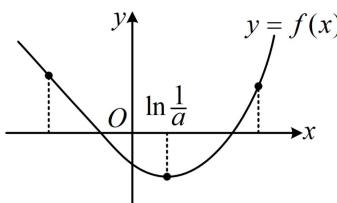
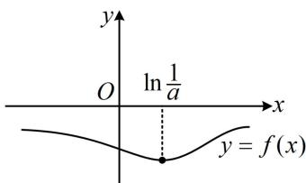

<!-- question-source:start -->
【变式】(2017·新课标Ⅰ卷)已知函数 $f(x) = ae^{2x} + (a - 2)e^x - x$ .

(1) 讨论 $f(x)$ 的单调性;

(2) 若 $f(x)$ 有两个零点，求 a 的取值范围.

（1）由题意， $f(x)$ 的定义域为R，且 $f'(x)=2ae^{2x}+(a-2)e^{x}-1=(2e^{x}+1)(ae^{x}-1)$ ，

（观察发现 $f'(x)$ 的正负由 $ae^x - 1$ 决定，而 $ae^x - 1$ 的正负情况又受 $a$ 的正负影响，故据此讨论）当 $a \leq 0$ 时， $2e^x + 1 > 0$ ， $ae^x - 1 < 0$ ，所以 $f'(x) < 0$ 恒成立，故 $f(x)$ 在 $\mathbf{R}$ 上单调递减，

当 $a > 0$ 时， $f'(x) > 0 \Leftrightarrow ae^x - 1 > 0 \Leftrightarrow e^x > \frac{1}{a} \Leftrightarrow x > \ln \frac{1}{a}$ ， $f'(x) < 0 \Leftrightarrow x < \ln \frac{1}{a}$ ，

所以 $f(x)$ 在 $\left(-\infty, \ln \frac{1}{a}\right)$ 上单调递减，在 $\left(\ln \frac{1}{a}, +\infty\right)$ 上单调递增.

（2）当 $a \leq 0$ 时，由
（1）知 $f(x)$ 在 $\mathbf{R}$ 上单调递减，故 $f(x)$ 至多1个零点，不合题意；

当 $a > 0$ 时，由
（1）知 $f(x)$ 在 $\left(-\infty, \ln \frac{1}{a}\right)$ 上单调递减，在 $\left(\ln \frac{1}{a}, +\infty\right)$ 上单调递增，

若 $f(x)$ 有2个零点，则如图1，必有 $f\left(\ln \frac{1}{a}\right) = 1 - \frac{1}{a} +\ln a <   0$ ①

  
图1

  
图2

（怎样由此求 $a$ 的范围？观察发现当 $a = 1$ 时， $1 - \frac{1}{a} + \ln a$ 恰好为0，故可尝试直接分析 $1 - \frac{1}{a} + \ln a$ 在 $a = 1$ 两侧的正负）若 $a \geq 1$ ，则 $1 - \frac{1}{a} \geq 0$ ， $\ln a \geq 0$ ，从而 $1 - \frac{1}{a} + \ln a \geq 0$ ，不等式①不成立，

若 $0 < a < 1$ ，则 $1 - \frac{1}{a} < 0$ ， $\ln a < 0$ ，所以 $1 - \frac{1}{a} + \ln a < 0$ ，故不等式①成立，

(结束了吗? 没有, 仅满足 $f(\ln \frac{1}{a}) < 0$ 时, $f(x)$ 不一定有 2 个零点, 如图 2. 若要严格论证 $f(x)$ 有 2 个零点, 如图 1, 还应在 $x = \ln \frac{1}{a}$ 左右两侧各取 1 个满足 $f(x) > 0$ 的点. 先看左边的点怎么取, 注意到 $\ln \frac{1}{a} > 0$ , 所以可尝试在 $(- \infty, 0)$ 上取一个点, 可以先试试取 -1, -2 这些比较简单的常数点, 经尝试, 取 -1 就行)

又因为 $f(-1) = ae^{-2} + (a - 2)\mathrm{e}^{-1} + 1 = \mathrm{e}^{-2}[a(\mathrm{e} + 1) + \mathrm{e}^2 -2\mathrm{e}] > 0$ ，所以 $f(x)$ 在 $\left(-1,\ln \frac{1}{a}\right)$ 上有1个零点，

(再看 $x = \ln \frac{1}{a}$ 右侧的点怎么取, 由于当 $0 < a < 1$ 时, $\ln \frac{1}{a}$ 的值域是 $(0, +\infty)$ , 故可想象, 无论取哪个常数,都不一定比 $\ln \frac{1}{a}$ 大, 所以不能像左边那样操作, 可尝试先通过放缩将 $f(x)$ 的解析式化简, 再取点, 如何放缩？不难发现当 $x \to +\infty$ 时， $f(x) \to +\infty$ ，且主要部分是 $a e^{2 x}$ ，另外两项都是次要部分，为了便于判断 $f(x)$ 的正负，可考虑用 $e^x > x$ 放缩，这样放缩后，可提 $e^x$ ，从而使所得式子容易判断正负，下面先证 $e^x > x$ ）设 $p(x) = e^x - x$ ， $x \in \mathbb{R}$ ，则 $p'(x) = e^x - 1$ ，所以 $p'(x) < 0 \Leftrightarrow x < 0$ ， $p'(x) > 0 \Leftrightarrow x > 0$ ，从而 $p(x)$ 在 $(- \infty, 0)$ 上单调递减，在 $(0, +\infty)$ 上单调递增，故 $p(x) \geq p(0) = 1 > 0$ ，即 $e^x - x > 0$ ，所以 $e^x > x$ ，故 $f(x) = a e^{2 x} + (a - 2)e^x - x > a e^{2 x} + (a - 2)e^x - e^x = a e^{2 x} + (a - 3)e^x = a e^x \left(e^x - \frac{3 - a}{a}\right)$ ，即 $f(x) > a e^x \left(e^x - \frac{3 - a}{a}\right)$ ②，（观察要使 $f(x) > 0$ ，只需 $e^x - \frac{3 - a}{a} \geq 0$ ，即 $x \geq \ln \frac{3 - a}{a}$ ，故取 $x = \ln \frac{3 - a}{a}$ 就能满足要求）在②中取 $x = \ln \frac{3 - a}{a}$ 得 $f\left(\ln \frac{3 - a}{a}\right) > a e^{\ln \frac{3 - a}{a}} \left(e^{\ln \frac{3 - a}{a}} - \frac{3 - a}{a}\right) = 0$ ，又 $\frac{3 - a}{a} = \frac{3}{a} - 1 = \frac{1}{a} + \left(\frac{2}{a} - 1\right) > \frac{1}{a}$ ，所以 $\ln \frac{3 - a}{a} > \ln \frac{1}{a}$ ，结合 $f\left(\ln \frac{1}{a}\right) < 0$ 得 $f(x)$ 在 $\left(\ln \frac{1}{a}, \ln \frac{3 - a}{a}\right)$ 上有 1 个零点，综上所述，当 $f(x)$ 有 2 个零点时，实数 $a$ 的取值范围是 (0,1).
<!-- question-source:end -->

![[高中/总复习/教辅/一数常规版2026/第3章 函数与导数/模块8：导数综合大题/第1节 隐零点、零点讨论、切割线放缩/类型02_零点讨论/例题/answers/Q00050027A1.md]]
