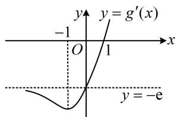
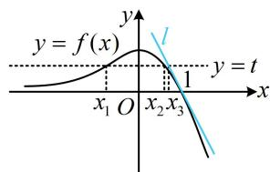
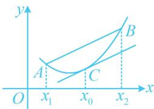
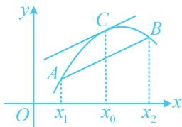

<!-- question-source:start -->
【例 3】已知曲线 $C: f(x) = \mathrm{e}^{x} - x \mathrm{e}^{x}$ 在点 $A(1, f
(1))$ 处的切线为 l.

(1) 求直线 l 的方程;

（2）证明：除点 $A$ 外，曲线 $C$ 在直线 $l$ 的下方；

（3）设 $f(x_{1}) = f(x_{2}) = t$ ， $x_{1}\neq x_{2}$ ，求证： $x_{1} + x_{2} <   2t - \frac{t}{\mathrm{e}} -1$

（1）因为 $f(x)=\mathrm{e}^{x}-xe^{x}$ ，所以 $f
(1)=0$ ， $f'(x)=\mathrm{e}^{x}-(\mathrm{e}^{x}+xe^{x})=-xe^{x}$ ，故 $f' (1)=-\mathrm{e}$ ，所以直线 l 的方程为 $y-0=-\mathrm{e}(x-1)$ ，即 $y=-\mathrm{e}x+\mathrm{e}$ 。

(2) (要证结论成立, 即证 $f(x) \leq -\mathrm{e}x + \mathrm{e}$ , 当且仅当 $x = 1$ 时取等号, 此不等式不算复杂, 可考虑直接移项构造函数分析) 令 $g(x) = -\mathrm{e}x + \mathrm{e} - f(x) = -\mathrm{e}x + \mathrm{e} - \mathrm{e}^x + x\mathrm{e}^x$ , 则 $g'(x) = -\mathrm{e} - \mathrm{e}^x + \mathrm{e}^x + x\mathrm{e}^x = -\mathrm{e} + x\mathrm{e}^x$ , (不易直接判断正负, 考虑二次求导) 所以 $g''(x) = \mathrm{e}^x + x\mathrm{e}^x = (x + 1)\mathrm{e}^x$ , 从而 $g''(x) < 0 \Leftrightarrow x < -1$ , $g''(x) > 0 \Leftrightarrow x > -1$ , 故 $g'(x)$ 在 $(- \infty, -1)$ 上单调递减, 在 $(-1, +\infty)$ 上单调递增.

（为了判断 $g'(x)$ 的正负，我们可以先用极限做个分析，当 $x \to -\infty$ 时， $g'(x) = -\mathrm{e} + x\mathrm{e}^x = -\mathrm{e} + \frac{x}{\mathrm{e}^{-x}} \to -\mathrm{e}$ ，当 $x \to +\infty$ 时， $g'(x) \to +\infty$ ，结合 $g'
(1) = 0$ 可知 $g'(x)$ 的大致图象如图1，其正负情况就明朗了，下面我们来严格论证）当 $x < 0$ 时， $g'(x) = -\mathrm{e} + x\mathrm{e}^x < 0$ ，又 $g' (1) = 0$ ，所以如图1， $g'(x) < 0 \Leftrightarrow x < 1$ ， $g'(x) > 0 \Leftrightarrow x > 1$ ，从而 $g(x)$ 在 $(- \infty, 1)$ 上单调递减，在 $(1, +\infty)$ 上单调递增，故 $g(x) \geq g (1) = 0$ ，当且仅当 $x = 1$ 时等号成立，所以除切点 $A(1, 0)$ 之外，曲线 $C$ 在直线 $l$ 的下方.

  
图1

  
图2

(3) (目标不等式涉及 $x_{1}, x_{2}, t$ 三个变量, 虽然 $x_{1}, x_{2}$ 由 $t$ 决定, 但显然由 $f(x_{1}) = f(x_{2}) = t$ 无法把 $x_{1}, x_{2}$ 用 $t$ 表示, 故无法由此统一变量, 怎么办呢? 若没有其他想法, 不妨画出 $f(x)$ 的图象, 从图上找思路)由
(1) 可得 $f'(x) = -x \mathrm{e}^{x}$ , 所以 $f'(x) > 0 \Leftrightarrow x < 0$ , $f'(x) < 0 \Leftrightarrow x > 0$ ,

故 $f(x)$ 在 $(- \infty, 0)$ 上单调递增，在 $(0, +\infty)$ 上单调递减，不妨设 $x_1 < x_2$ ，则由 $f(x_1) = f(x_2) = t$ 得 $x_1 < 0 < x_2$ ，因为当 $x_1 < 0$ 时， $f(x_1) = e^{x_1} - x_1e^{x_1} = (1 - x_1)e^{x_1} > 0$ ，所以 $f(x_2) > 0$ ，又因为 $f(x)$ 在 $(0, +\infty)$ 上单调递减，且 $f
(1) = 0$ ，所以 $0 < x_2 < 1$ （由于当 $x \to -\infty$ 时， $f(x) \to 0$ ，当 $x \to +\infty$ 时， $f(x) \to -\infty$ ，所以 $f(x)$ 的草图如图2，第
（2）问我们证明了 $f(x)$ 的图象始终在切线 $l$ 的下方，设 $l$ 与直线 $y = t$ 的交点横坐标为 $x_3$ ，不难求得 $x_3 = 1 - \frac{t}{e}$ ，这个 $\frac{t}{e}$ 在目标不等式中也有，且从图2可以看出 $x_2 < x_3$ ，故尝试按此放缩，下面先证明 $x_2 < x_3$ ）由 （2）可得 $g(x_2) = -ex_2 + e - f(x_2) = -ex_2 + e - t > 0$ ，所以 $x_2 < \frac{e - t}{e} = 1 - \frac{t}{e}$ ，故 $x_1 + x_2 < x_1 + 1 - \frac{t}{e}$ ，所以要证 $x_1 + x_2 < 2t - \frac{t}{e} - 1$ ，只需证 $x_1 + 1 - \frac{t}{e} < 2t - \frac{t}{e} - 1$ ，即证 $x_1 < 2t - 2$ ①，（只有 $t$ 和 $x_1$ 两个变量了，若能将它们统一，就能构造函数求导分析，能否统一？可以，注意到 $t = f(x_1)$ ，所以代入上式即可将变量统一成 $x_1$ ）因为 $t = f(x_1)$ ，所以代入①知要证原不等式成立，只需证 $x_1 < 2f(x_1) - 2$ ，即证 $x_1 < 2(e^{x_1} - x_1e^{x_1}) - 2$ ，化简得只需证 $2(1 - x_1)e^{x_1} - x_1 - 2 > 0$ ②，（不等式②已不复杂，可考虑直接构造函数求导分析）设 $F(x) = 2(1 - x)e^x - x - 2$ ， $x < 0$ ，则 $F'(x) = 2[-e^x + (1 - x)e^x] - 1 = -2xe^x - 1$ ， $F''(x) = -2(e^x + xe^x) = -2(1 + x)e^x$ ，所以 $F''(x) > 0 \Leftrightarrow x < -1$ ， $F''(x) < 0 \Leftrightarrow -1 < x < 0$ ，故 $F'(x)$ 在 $(- \infty, -1)$ 上单调递增，在 $(-1, 0)$ 上单调递减，所以 $F'(x) \leq F'(-1) = \frac{2}{e} - 1 < 0$ ，从而 $F(x)$ 在 $(- \infty, 0)$ 上单调递减，故 $F(x) > F(0) = 0$ 成立，取 $x = x_1$ 得 $F(x_1) = 2(1 - x_1)e^{x_1} - x_1 - 2 > 0$ ，所以不等式②成立，故 $x_1 + x_2 < 2t - \frac{t}{e} - 1$ 成立。【反思】当从代数的角度不方便找到证明不等式的方法时，还可尝试从图形出发寻找思路，利用切割线来放缩就是一种具有深刻图形背景的放缩方法，具体来说，有两种情况：①下凸函数：如图1，对于函数 $f(x)$ ，若在其图象上任取两点 $A(x_1, f(x_1))$ ， $B(x_2, f(x_2))$ ，除端点外，线段AB始终在函数 $f(x)$ 的图象的上方，在 $f(x)$ 的图象上任取点C，函数 $f(x)$ 在点C处的切线满足除切点外，切线始终在 $f(x)$ 图象的下方，我们称 $f(x)$ 为下凸函数，满足 $f''(x) \geq 0$ 的函数 $f(x)$ 为下凸函数。对于下凸函数，有切线放缩： $f(x) \geq f'(x_0)(x - x_0) + f(x_0)$ ，以及割线放缩：当 $x \in (x_1, x_2)$ 时， $f(x) < \frac{f(x_1) - f(x_2)}{x_1 - x_2}(x - x_1) + f(x_1)$ 。②上凸函数：如图2，对于函数 $f(x)$ ，若在其图象上任取两点 $A(x_1, f(x_1))$ ， $B(x_2, f(x_2))$ ，除端点外，线段AB始终在函数 $f(x)$ 的图象的下方，在 $f(x)$ 的图象上任取点C，函数 $f(x)$ 在点C处的切线满足除切点外，切线始终在 $f(x)$ 图象的上方，我们称 $f(x)$ 为上凸函数，满足 $f''(x) \leq 0$ 的函数 $f(x)$ 为上凸函数。对于上凸函数，有切线放缩： $f(x) \leq f'(x_0)(x - x_0) + f(x_0)$ ，以及割线放缩：当 $x \in (x_1, x_2)$ 时， $f(x) > \frac{f(x_1) - f(x_2)}{x_1 - x_2}(x - x_1) + f(x_1)$ 。

  
图1

  
图2
<!-- question-source:end -->

![[高中/总复习/教辅/一数常规版2026/第3章 函数与导数/模块8：导数综合大题/第1节 隐零点、零点讨论、切割线放缩/类型03_切割线放缩/例题/answers/Q00050028A1.md]]
