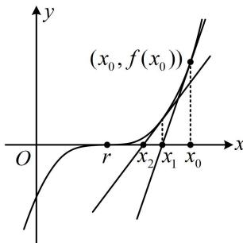

<!-- question-source:start -->
## 1. (2024·贵州贵阳模拟·★★★★)

牛顿迭代法是牛顿在 17 世纪提出的一种在实数域和复数域上近似求解方程的方法. 比如, 我们可以先猜想某个方程 $f(x) = 0$ 的其中一个根 $r$ 在 $x = x_0$ 的附近, 如图所示, 然后在点 $(x_0, f(x_0))$ 处作 $f(x)$ 的切线, 切线与 $x$ 轴交点的横坐标就是 $x_1$ , 用 $x_1$ 代替 $x_0$ 重复上面的过程得到 $x_2$ ; 一直继续下去, 得到 $x_0, x_1, x_2, \cdots, x_n$ . 从图形上我们可以看到 $x_1$ 较 $x_0$ 接近 $r$ , $x_2$ 较 $x_1$ 接近 $r$ , 等等. 显然, 它们会越来越逼近 $r$ . 于是求 $r$ 近似解的过程转化为求 $x_n$ , 若设精度为 $\varepsilon$ , 则把首次满足 $\left|x_n - x_{n-1}\right| < \varepsilon$ 的 $x_n$ 称为 $r$ 的近似解.

已知函数 $f(x)=x^{3}+(a-2)x+a,\quad a\in\mathbf{R}$ .

（1）当 $a = 1$ 时，试用牛顿迭代法求方程 $f(x) = 0$ 满足精度 $\varepsilon = 0.5$ 的近似解（取 $x_0 = -1$ ，且结果保留小数点后第二位）；

（2）若 $f(x) - x^{3} + x^{2}\ln x\geq 0$ ，求 $\pmb{a}$ 的取值范围.

<!-- question-source:end -->

![[Q00050044A1]]
