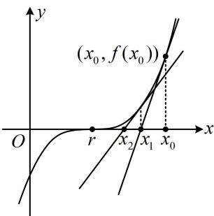

> [!faq]- 《第2节 恒成立问题、多变量问题、求和不等式证明》参考答案
>
> > [!success]- **【答案】** 详见解析
>
> > [!note]- **【分析】**
> > 本题未单列分析。
>
> > [!note]- **【解析】**
> > 解：（1）当 $a = 1$ 时， $f(x) = x^3 - x + 1$
> >
> > 
> >
> > (用牛顿迭代法求近似解, 依次求切线及其与 $x$ 轴的交点, 直到满足精度要求即可)
> >
> > 因为 $f'(x)=3x^{2}-1$ ，所以 $f'(x_{0})=f'(-1)=2$ ，
> >
> > 又 $f(x_0) = f(-1) = 1$ ，所以 $f(x)$ 在 $(x_0, f(x_0))$ 处的切线方程为 $y - 1 = 2(x + 1)$ ，
> >
> > 令 $y = 0$ 得 $x = -\frac{3}{2}$ ，即 $x_{1} = -\frac{3}{2}$ ，因为 $\left|x_1 - x_0\right| = 0.5$
> >
> > 不满足精度要求，故继续求下一条切线，
> >
> > 因为 $f^{\prime}(x_{1}) = f^{\prime}\left(-\frac{3}{2}\right) = \frac{23}{4},\quad f(x_{1}) = f\left(-\frac{3}{2}\right) = -\frac{7}{8},$
> >
> > 所以 $f(x)$ 在 $(x_{1}, f(x_{1}))$ 处的切线方程为 $y + \frac{7}{8} = \frac{23}{4} \left( x + \frac{3}{2} \right)$ ,
> >
> > 令 $y = 0$ 得 $x = -\frac{31}{23}$ ，所以 $x_{2} = -\frac{31}{23}$
> >
> > 因为 $\left|x_{2}-x_{1}\right|=\left|-\frac{31}{23}+\frac{3}{2}\right|=\frac{7}{46}<0.5$ ，满足精度要求，
> >
> > 所以方程 $f(x) = 0$ 的近似解为 $-\frac{31}{23}$
> >
> > 保留到小数点后第二位约为-1.35.
> >
> > （2）解法1： $f(x) - x^{3} + x^{2}\ln x\geq 0\Leftrightarrow x^{3} + (a - 2)x+$
> >
> > $a - x^{3} + x^{2}\ln x\geq 0\Leftrightarrow (a - 2)x + a + x^{2}\ln x\geq 0$ ①，（观察发现①中的参数 $a$ 容易分离出来，故可尝试用参变分离处理）不等式① $\Leftrightarrow a(x + 1) - 2x + x^2\ln x\geq 0\Leftrightarrow a\geq \frac{2x - x^2\ln x}{x + 1}$ ②，
> >
> > 令 $g(x) = \frac{2x - x^2\ln x}{x + 1} (x > 0)$
> >
> > 则 $g'(x)=\frac{\left[2-\left(2x\ln x+x^{2}\cdot\frac{1}{x}\right)\right](x+1)-(2x-x^{2}\ln x)}{(x+1)^{2}}$ $=\frac{-x^{2}-x+2-(x^{2}+2x)\ln x}{(x+1)^{2}}=\frac{(1-x)(x+2)-x(x+2)\ln x}{(x+1)^{2}}$ $=\frac{(x+2)(1-x-x\ln x)}{(x+1)^{2}}$
> >
> > （只有 $1 - x - x\ln x$ 这部分正负不易看出，故对它进行分析。观察发现该式有零点1，故可尝试分析它在1两侧的符号）当 $0 < x < 1$ 时， $1 - x > 0$ ， $x\ln x < 0$ ，所以 $1 - x - x\ln x > 0$ ，故 $g'(x) > 0$ ，当 $x > 1$ 时， $1 - x < 0$ ， $x\ln x > 0$ ，所以 $1 - x - x\ln x < 0$ ，故 $g'(x) < 0$ ，所以 $g(x)$ 在 $(0,1)$ 上单调递增，在 $(1, +\infty)$ 上单调递减，故 $g(x)_{\max} = g(1) = 1$ ，由②知 $a \geq g(x)$ 恒成立，所以 $a \geq 1$ ，故 $a$ 的取值范围是 $[1, +\infty)$ 。
> >
> > 解法2：（按解法1得到不等式①后，由于有 $x^{2}\ln x$ ，故也可考虑同除以 $x^{2}$ ，将 $\ln x$ 孤立出来，再构造函数求导分析）不等式①等价于 $\frac{a - 2}{x} +\frac{a}{x^2} +\ln x\geq 0$ ，设 $h(x) =$ $\frac{a - 2}{x} +\frac{a}{x^2} +\ln x(x > 0)$ ，则 $h(x)\geq 0$ 恒成立，且 $h^{\prime}(x) =$ $-\frac{a - 2}{x^2} -\frac{2a}{x^3} +\frac{1}{x} = \frac{x^2 - (a - 2)x - 2a}{x^3} = \frac{(x - a)(x + 2)}{x^3},$
> >
> > 当 $a \leq 0$ 时，（此时 $h'(x) > 0$ ， $h(x)$ 在 $(0, +\infty)$ 上 $\nearrow$ ， $h(x) \geq 0$ 能否恒成立呢？可尝试分析解析式各部分的正负情况，观察发现 $\frac{a - 2}{x} < 0$ ， $\frac{a}{x^2} \leq 0$ ，故若 $\ln x \leq 0$ ，就有 $h(x) < 0$ ，于是 $h(x) \geq 0$ 不恒成立，我们取个点来否定结论即可，不妨就取1）
> >
> > $$
> > h (1) = 2 a - 2 <   0
> > $$
> >
> > $$
> > h ^ {\prime} (x) > 0 \Leftrightarrow x > a, h ^ {\prime} (x) <   0 \Leftrightarrow 0 <   x <   a
> > $$
> >
> > 所以 $h(x)$ 在 $(0,a)$ 上单调递减，在 $(a, + \infty)$ 上单调递增，
> >
> > $$
> > h (x) _ {\min} = h (a) = \frac {a - 2}{a} + \frac {a}{a ^ {2}} + \ln a = 1 - \frac {1}{a} + \ln a
> > $$
> >
> > $$
> > 1 - \frac {1}{a} + \ln a \geq 0 \quad ③
> > $$
> >
> > $$
> > 1 - \frac {1}{a} + \ln a = 0
> > $$
> >
> > $$
> > 1 - \frac {1}{a} + \ln a
> > $$
> >
> > $$
> > 0 <   a <   1
> > $$
> >
> > $$
> > 1 - \frac {1}{a} = \frac {a - 1}{a} <
> > $$
> >
> > $$
> > 1 - \frac {1}{a} + \ln a <   0
> > $$
> >
> > $$
> > a \geq 1
> > $$
> >
> > $$
> > 1 - \frac {1}{a} = \frac {a - 1}{a} \geq 0, \quad \ln a \geq 0
> > $$
> >
> > $$
> > 1 - \frac {1}{a} + \ln a \geq 0
> > $$
> >
> > 综上所述，实数 $a$ 的取值范围是 $[1, +\infty)$
