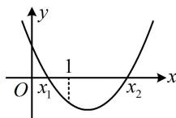

> [!faq]- 《第2节 恒成立问题、多变量问题、求和不等式证明》参考答案
>
> > [!success]- **【答案】** 详见解析
>
> > [!note]- **【分析】**
> > 本题未单列分析。
>
> > [!note]- **【解析】**
> > 解：（1）由题意， $f'(x) = a - \frac{1}{x} + \frac{a}{x^2} = \frac{ax^2 - x + a}{x^2}$ ，
> >
> > （接下来应讨论 $f(x)$ 的单调性，分界点怎么找呢？注意到 $f(1) = 0$ ，有端点效应，所以要使当 $x > 1$ 时， $f(x) > 0$ ，必须满足 $f'(1) = 2a - 1 \geq 0$ ，由此可找到讨论的分界点）
> >
> > 当 $a \geq \frac{1}{2}$ 时， $ax^2 - x + a \geq \frac{1}{2} x^2 - x + \frac{1}{2} = \frac{1}{2}(x - 1)^2 > 0$
> >
> > 所以 $f^{\prime}(x) > 0$ ，故 $f(x)$ 在 $(1, + \infty)$ 上单调递增，
> >
> > 又 $f(1) = 0$ ，所以当 $x > 1$ 时， $f(x) > 0$ ，满足题意；
> >
> > (再看 $a < \frac{1}{2}$ 的情况，由于 a 的正负会影响开口，所以又将 0 作为讨论的分界点，分两种情况讨论)
> >
> > 当 $a \leq 0$ 时， $ax^2 - x + a \leq -x < 0$ ，所以 $f'(x) < 0$
> >
> > 故 $f(x)$ 在 $(1, +\infty)$ 上单调递减，
> >
> > 结合 $f(1)=0$ 可得当 x>1 时， $f(x)<0$ ，不合题意；
> >
> > $$
> > 0 <   a <   \frac {1}{2}
> > $$
> >
> > $$
> > y = a x ^ {2} - x + a
> > $$
> >
> > $$
> > y = 2 a - 1 <   0
> > $$
> >
> > 令 $f^{\prime}(x) = 0$ 可得 $x_{1} = \frac{1 - \sqrt{1 - 4a^{2}}}{2a}$ ， $x_{2} = \frac{1 + \sqrt{1 - 4a^{2}}}{2a}$
> >
> > 当 $1 < x < x_{2}$ 时， $f'(x) < 0$ ，故 $f(x)$ 在 $(1, x_{2})$ 上单调递减，
> >
> > 结合 $f(1) = 0$ 可得当 $1 < x < x_{2}$ 时， $f(x) < 0$ ，不合题意；
> >
> > 综上所述，实数 a 的取值范围是 $\left[\frac{1}{2}, +\infty\right)$ .
> >
> > 
> >
> > （2）由（1）可知当且仅当 $0 < a < \frac{1}{2}$ 时， $f'(x)$ 有两个零点 $x_{1}, x_{2}$ ，不妨设 $x_{1} < x_{2}$ ，则 $0 < x_{1} < 1 < x_{2}$ ，且 $f'(x) > 0 \Leftrightarrow 0 < x < x_{1}$ 或 $x > x_{2}$ ， $f'(x) < 0 \Leftrightarrow x_{1} < x < x_{2}$ ，
> >
> > 所以 $f(x)$ 在 $(0,x_1)$ 和 $(x_{2}, + \infty)$ 上单调递增，在 $(x_{1},x_{2})$ 上单调递减，故 $f(x_{1}) > f(x_{2})$
> >
> > 所以 $\left|f(x_1) - f(x_2)\right| = f(x_1) - f(x_2) = ax_1 - \ln x_1 - \frac{a}{x_1} -$
> >
> > $$
> > a x _ {2} + \ln x _ {2} + \frac {a}{x _ {2}} = a (x _ {1} - x _ {2}) + \frac {a (x _ {1} - x _ {2})}{x _ {1} x _ {2}} + \ln \frac {x _ {2}}{x _ {1}} \quad ①,
> > $$
> >
> > （式①有3个变量，应考虑消元， $x_{1}$ ， $x_{2}$ 和a之间可由韦达定理建立联系，故先写出韦达定理，将式①化简）因为 $x_{1}$ ， $x_{2}$ 是方程 $ax^{2}-x+a=0$ 的两根，
> >
> > 所以 $x_{1} + x_{2} = \frac{1}{a},\quad x_{1}x_{2} = 1$
> >
> > 代入①得 $\left|f(x_1) - f(x_2)\right| = 2a(x_1 - x_2) + \ln \frac{x_2}{x_1}$
> >
> > 由（1）知 $x_{1} = \frac{1 - \sqrt{1 - 4a^{2}}}{2a}$ ， $x_{2} = \frac{1 + \sqrt{1 - 4a^{2}}}{2a}$
> >
> > 所以 $x_{2} - x_{1} = \frac{\sqrt{1 - 4a^{2}}}{a}$
> >
> > 故要证的不等式即为 $2a(x_{1} - x_{2}) + \ln \frac{x_{2}}{x_{1}} < x_{2} - x_{1}$ ②，
> >
> > （此式仍有3个变量，继续消元，由于 $a$ 只出现一次，故消去 $a$ ， $x_{1}$ 和 $x_{2}$ 则随便保留一个，不妨保留 $x_{2}$ ）因为 $x_{1}x_{2} = 1$ ，所以 $x_{1} = \frac{1}{x_{2}}$
> >
> > 代入 $x_{1} + x_{2} = \frac{1}{a}$ 可得 $\frac{1}{x_2} +x_2 = \frac{1}{a}$ ，所以 $a = \frac{x_2}{1 + x_2^2}$
> >
> > 代入②知要证 $\left|f(x_1) - f(x_2)\right| <   \frac{\sqrt{1 - 4a^2}}{a}$
> >
> > 只需证 $\frac{2x_2}{1 + x_2^2}\left(\frac{1}{x_2} -x_2\right) + \ln x_2^2 <  x_2 - \frac{1}{x_2},$
> >
> > 即证 $\frac{2(1 - x_2^2)}{1 + x_2^2} + 2\ln x_2 - x_2 + \frac{1}{x_2} < 0$ ③，（只含 $x_2$ 了，接下来只需将 $x_2$ 看成变量，构造函数求导分析即可）
> >
> > 设 $g(x) = \frac{2(1 - x^2)}{1 + x^2} + 2\ln x - x + \frac{1}{x}$ , $x > 1$ ,
> >
> > $$
> > g ^ {\prime} (x) = \frac {- 4 x (1 + x ^ {2}) - 2 x \cdot 2 (1 - x ^ {2})}{(1 + x ^ {2}) ^ {2}} + \frac {2}{x} - 1 - \frac {1}{x ^ {2}}
> > $$
> >
> > $$
> > = - \frac {8 x}{\left(1 + x ^ {2}\right) ^ {2}} - \frac {(x - 1) ^ {2}}{x ^ {2}} <   0,
> > $$
> >
> > 所以 $g(x)$ 在 $(1, +\infty)$ 上单调递减，
> >
> > 又 $g(1) = 0$ ，所以 $g(x) <   0$
> >
> > 故 $g(x_{2}) = \frac{2(1 - x_{2}^{2})}{1 + x_{2}^{2}} + 2\ln x_{2} - x_{2} + \frac{1}{x_{2}} < 0$
> >
> > 即不等式③成立，所以 $\left|f(x_1) - f(x_2)\right| < \frac{\sqrt{1 - 4a^2}}{a}$ 成立. 必刷100讲
