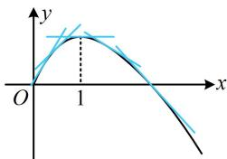
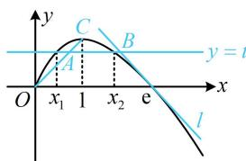

> [!faq]- 《第2节 恒成立问题、多变量问题、求和不等式证明》参考答案
>
> > [!success]- **【答案】** 详见解析
>
> > [!note]- **【分析】**
> > 本题未单列分析。
>
> > [!note]- **【解析】**
> > 解：（1）由题意， $f'(x)=1-\ln x+x\left(-\frac{1}{x}\right)=-\ln x(x>0)$
> >
> > 所以 $f^{\prime}(x) > 0\Leftrightarrow 0 <   x <   1$ ， $f^{\prime}(x) <   0\Leftrightarrow x > 1$
> >
> > 故 $f(x)$ 在 $(0,1)$ 上单调递增，在 $(1, +\infty)$ 上单调递减.
> >
> > (2) (观察发现所给等式 $a, b$ 的结构非常对称, 可考虑把 $a, b$ 分离到等号两侧再看)
> >
> > $$
> > b \ln a - a \ln b = a - b \Leftrightarrow \frac {\ln a}{a} - \frac {\ln b}{b} = \frac {1}{b} - \frac {1}{a}
> > $$
> >
> > $\Leftrightarrow \frac{1 + \ln a}{a} = \frac{1 + \ln b}{b}$ ①，（注意到要证的结论是 $\frac{1}{a}$ ， $\frac{1}{b}$ 这种结构，故把式①中的 $a, b$ 都化为 $\frac{1}{a}$ 和 $\frac{1}{b}$ ）
> >
> > 式①等价于 $\frac{1}{a}\left(1 - \ln \frac{1}{a}\right) = \frac{1}{b}\left(1 - \ln \frac{1}{b}\right)$ ，所以 $f\left(\frac{1}{a}\right) = f\left(\frac{1}{b}\right)$ ，
> >
> > 设 $x_{1} = \frac{1}{a}$ ， $x_{2} = \frac{1}{b}$ ，则 $f(x_{1}) = f(x_{2})$
> >
> > （问题即为在 $f(x_{1}) = f(x_{2})$ 的条件下证 $2 < x_{1} + x_{2} < e$ ，由（1）问可知 $x = 1$ 是 $f(x)$ 的极值点，故该不等式左半边是极值点偏移问题。 $x_{1} + x_{2} > 2$ 涉及的是自变量的大小，可考虑用单调性来证，为了将它们化到 $f(x)$ 的同一个单调区间上，我们移个项）不妨设 $0 < x_{1} < 1 < x_{2}$ ，要证 $x_{1} + x_{2} > 2$ ，即证 $x_{2} > 2 - x_{1}$ ，
> >
> > 因为 $x_{2}$ 和 $2 - x_{1}$ 都在 $(1, + \infty)$ 上，所以结合 $f(x)$ 在 $(1, + \infty)$ 上单调递减知只需证 $f(x_{2}) < f(2 - x_{1})$ （上式有两个变量，由于满足 $f(x_{1}) = f(x_{2})$ ，故可将 $f(x_{2})$ 换成 $f(x_{1})$ ，从而统一变量，构造函数分析）又 $f(x_{1}) = f(x_{2})$ ，故只需证 $f(x_{1}) < f(2 - x_{1})$ 即证 $f(x_{1}) - f(2 - x_{1}) < 0$ 设 $g(x) = f(x) - f(2 - x)$ ， $0 < x < 1$ ，则 $g'(x) = f'(x) + f'(2 - x) = -\ln x - \ln (2 - x) = -\ln [1 - (x - 1)^{2}] > 0$ 所以 $g(x)$ 在 $(0,1)$ 上单调递增，从而 $g(x_{1}) < g(1) = 0$ 即 $f(x_{1}) - f(2 - x_{1}) < 0$ ，故 $x_{1} + x_{2} > 2$ 成立；（再证 $x_{1} + x_{2} < e$ ，能仿照上述做法，按 $x_{1} + x_{2} < e \Leftrightarrow$
> >
> > $$
> > x _ {1} > x _ {2} \Leftrightarrow f (\mathrm{e} - x _ {1}) <   f (x _ {2}) = f (x _ {1})
> > $$
> >
> > $= f(\mathrm{e} - x) - f(x)$ 来证吗？经尝试，这样做行得通，但要回避分析 $h(x)$ 在 $x = 0$ 处的极限，以及判断 $h(1)$ 的正负都较难，怎么办呢？我们不妨画图看看，注意到 $f''(x) = -\frac{1}{x} < 0$ ，所以 $f'(x)$ 递减，故 $f(x)$ 的切线斜率递减， $f(x)$ 的弯曲方向只能是图1所示的情形，该图象的割线段都在图象的下方，切线都在图象的上方。此时若画一条水平直线 $y = t$ 与该图象交于两点，如图2，则 $x_{1} < x_{A}$ ， $x_{2} < x_{B}$ ，于是 $x_{1} + x_{2} <$
> >
> > $x_{A}+x_{B}$ ，此不等式与目标不等式右侧的方向一致，可以尝试。这种放缩的方法叫做“切割线放缩”，是本题最难想到的地方。下面先证明切割线的位置不等式，易求得割线 OC 的方程是 y=x，故需证 $f(x)>x$ ）
> >
> > 当 $0 < x < 1$ 时， $f(x) = x(1 - \ln x) = x - x\ln x > x$ ，
> > 设 $f(x_{1}) = f(x_{2}) = t$ ，则 $t = f(x_{1}) > x_{1}$ ，所以 $x_{1} < t$ ①，
> > （再证切线在图象上方，易求得 $f(x)$ 在 $x = e$ 处的切线是 $y = -x + e$ ，故需证 $f(x) < -x + e$ ，移项构造即可）在 $(0, e)$ 上， $f(x) > 0$ ，在 $[e, +\infty)$ 上， $f(x) \leq 0$ ，
> > 所以满足 $f(x_{1}) = f(x_{2})$ 的 $x_{2}$ 必在 $(1, e)$ 上，
> > 设 $r(x) = f(x) + x - e = x(1 - \ln x) + x - e$ ， $1 < x < e$ ，
> > 则 $r'(x) = 1 - \ln x > 0$ ，所以 $r(x)$ 在 $(1, e)$ 上单调递增，
> > 结合 $r(e) = 0$ 知 $r(x) < 0$ 恒成立，即 $f(x) + x - e < 0$ ，
> > 所以 $f(x) < -x + e$ 在 $(1, e)$ 上恒成立，故 $f(x_{2}) < -x_{2} + e$ ，
> > 又 $f(x_{2}) = t$ ，所以 $t < -x_{2} + e$ ，故 $x_{2} < e - t$ ②，
> > 由①②知 $x_{1} + x_{2} < t + (e - t) = e$ ，所以 $2 < x_{1} + x_{2} < e$ ，
> > 故 $2 < \frac{1}{a} + \frac{1}{b} < e$ 成立.
> >
> >   
> > 图1
> >
> >   
> > 图2
