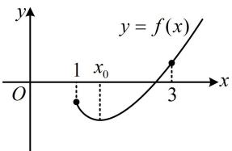
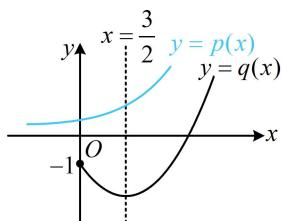
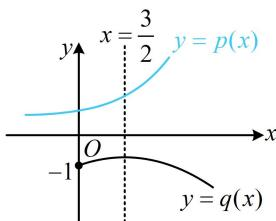
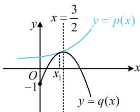

> [!faq]- 《第2节 恒成立问题、多变量问题、求和不等式证明》参考答案
>
> > [!success]- **【答案】** 详见解析
>
> > [!note]- **【分析】**
> > 本题未单列分析。
>
> > [!note]- **【解析】**
> > 由题意， $f'(x) = \mathrm{e}^{x - a} + 2ax - 3a$ ，（不好判断正负，考虑继续求导） $f''(x) = \mathrm{e}^{x - a} + 2a$ ，
> >
> > 当 $a > 1$ 时， $f''(x) > 0$ 在 $[1, +\infty)$ 上恒成立，
> >
> > 所以 $f^{\prime}(x)$ 在 $[1, + \infty)$ 上单调递增，因为 $f^{\prime}(1) = \mathrm{e}^{1 - a} - a$
> >
> > 且 $a > 1$ ，所以 $\mathrm{e}^{1 - a} <   \mathrm{e}^0 = 1$ ，故 $f^{\prime}(1) <   0$
> >
> > （可以想象，当 $x \to +\infty$ 时， $f'(x) \to +\infty$ ，所以 $f'(x)$ 有且仅有一个零点，若要严格论证，需要取出满足 $f'(x) > 0$ 的点，怎么取？观察发现 $f'(x)$ 的解析式中只有 $-3a$ 这部分为负，于是我们让 $2ax$ 与之抵消，就能满足 $f'(x) > 0$ ，故取 $x = \frac{3}{2}$ 即可）又因为 $f'\left(\frac{3}{2}\right) = \mathrm{e}^{\frac{3}{2} - a} + 2a \cdot \frac{3}{2} - 3a = \mathrm{e}^{\frac{3}{2} - a} > 0$ ，
> >
> > 所以 $f'(x)$ 在 $\left(1,\frac{3}{2}\right)$ 上有唯一的零点 $x_{0}$ ,
> >
> > 且当 $x \in [1, x_0)$ 时， $f'(x) < 0$ ， $f(x)$ 单调递减，
> >
> > 当 $x \in (x_0, +\infty)$ 时， $f'(x) > 0$ ， $f(x)$ 单调递增，
> >
> > 因为 $f(1) = \mathrm{e}^{1 - a} - 2a + 1$ ，由 $a > 1$ 可知 $\mathrm{e}^{1 - a} < 1$
> >
> > 所以 $f(1) < 1 - 2a + 1 = 2(1 - a) < 0$ ，故 $f(x_0) < 0$
> >
> > (可以想象, 当 $x \to +\infty$ 时, $f(x) \to +\infty$ , 所以 $f(x)$ 有且仅有一个零点, 若要严格论证, 又需取出使 $f(x) > 0$ 的点, 怎么取? 注意到 $f(x)$ 的解析式中只有 $-3ax$ 这部分为负, 故只需让 $ax^2$ 与之抵消, 就能使 $f(x) > 0$ , 故取 $x = 3$ 即可)
> >
> > 又因为 $f(3) = \mathrm{e}^{3 - a} + a\cdot 3^2 -3a\cdot 3 + 1 = \mathrm{e}^{3 - a} + 1 > 0$
> >
> > 所以如图1， $f(x)$ 在 $[1, + \infty)$ 上有且仅有1个零点.
> >
> >   
> > 图1
> >
> >   
> > 图2
> >
> > （3）（显然不方便由 $f(x) \geq 0$ 分离出参数 $a$ ，若直接求导讨论，则讨论的分界点也不好找，怎么办呢？可考虑画图找思路，为了便于画图，我们先把 $f(x) \geq 0$ 等价变形成 $\mathrm{e}^{x - a} \geq -ax^2 + 3ax - 1$ ，记 $p(x) = \mathrm{e}^{x - a}$ ， $q(x) = -ax^2 + 3ax - 1$ ，则 $p(x) \geq q(x)$ 在 $[0, +\infty)$ 上恒成立，由于 $a$ 的正负会影响 $q(x)$ 的开口，故讨论.
> >
> > 若 a<0，如图 2, $q(x)$ 开口向上，对称轴为 $x=\frac{3}{2}$ ，过定点 $(0,-1)$ ，随着参数 a 的减小， $p(x)$ 会向左移，而 $q(x)$ 的顶点 $\left(\frac{3}{2},\frac{9a}{4}-1\right)$ 会下移，但指数型函数的图象比二次函数更陡峭，故可猜测 $p(x)\geq q(x)$ 在 $[0,+\infty)$ 上恒成立；
> >
> > 若 $a = 0$ ，则 $f(x)\geq 0$ 即为 $\mathrm{e}^x +1\geq 0$ ，显然恒成立；
> >
> > 若 $a > 0$ ，则 $q(x)$ 开口向下，对称轴为 $x = \frac{3}{2}$ ，过定点 $(0, - 1)$ ，当 $a$ 接近0时，大致的情况如图3，随着 $a$ 增大， $p(x)$ 会右移，$q(x)$ 的顶点 $\left(\frac{3}{2},\frac{9a}{4} -1\right)$ 会上移， $p(x)\geq q(x)$ 的临界状态如图4，只要求出这一临界状态， $a$ 的范围就有了，怎么求？临界状态下两图象在唯一交点处应有公切线，故若设交点的横坐标为 $x_{1}$ ，则 $\left\{ \begin{array}{l}p(x_1) = q(x_1)\\ p'(x_1) = q'(x_1) \end{array} \right.$ 即 $\left\{ \begin{array}{l}\mathrm{e}^{x_1 - a} = -ax_1^2 +3ax_1 - 1\\ \mathrm{e}^{x_1 - a} = -2ax_1 + 3a \end{array} \right.$ ，所以 $-ax_{1}^{2} + 3ax_{1} - 1 = -2ax_{1} + 3a$ ，故 $ax_{1}^{2} - 5ax_{1} + 3a + 1 = 0$ ，正面求解此方程的结果较复杂，考虑猜根，观察发现 $a = x_{1} = 1$ 满足此方程，代回检验可发现方程组 $\left\{ \begin{array}{l}\mathrm{e}^{x_1 - a} = -ax_1^2 +3ax_1 - 1\\ \mathrm{e}^{x_1 - a} = -2ax_1 + 3a \end{array} \right.$ 也成立，临界状态就求出来了.通过上面的分析，我们发现要使 $p(x)\geq q(x)$ 在 $[0, + \infty)$ 上恒成立，只需抓住 $x = 1$ 这个关键位置，于是作答时，可取 $x = 1$ 来限定参数 $a$ 的范围，得到 $f(x)\geq 0$ 成立的必要条件，再论证充分性）
> >
> >   
> > 图3
> >
> >   
> > 图4
> >
> > 由题意，当 $x \geq 0$ 时， $f(x) \geq 0$ 恒成立，
> >
> > 所以 $f(1) = \mathrm{e}^{1 - a} - 2a + 1\geq 0$ ，（上述不等式不方便直接解，可将 $a$ 看成变量，构造函数求导分析）设 $g(a) = \mathrm{e}^{1 - a} - 2a + 1$ ，则 $g^{\prime}(a) = -\mathrm{e}^{1 - a} - 2 <   0$ 所以 $g(a)$ 在 $\mathbf{R}$ 上单调递减，又 $g(1) = \mathrm{e}^{1 - 1} - 2\times 1 + 1 = 0$ 所以 $g(a)\geq 0\Leftrightarrow \mathrm{e}^{1 - a} - 2a + 1\geq 0\Leftrightarrow a\leq 1$
> >
> > （通过前面的分析，我们已经知道 $a \leq 1$ 就是最终答案，所以下面再证明充分性，怎么证？从前面的图形分析我们知道， $a \leq 0$ 与 $0 < a \leq 1$ 时的图形特征不同，于是分两种情况讨论）  
> > 当 $a \leq 0$ 时， $f'(x) = \mathrm{e}^{x - a} + 2ax - 3a$ ， $f''(x) = \mathrm{e}^{x - a} + 2a$ ， $f'''(x) = \mathrm{e}^{x - a} > 0$ ，所以 $f''(x)$ 在 $[0, +\infty)$ 上单调递增，  
> > 又 $f''(0) = \mathrm{e}^{-a} + 2a$ ，设 $h(a) = \mathrm{e}^{-a} + 2a$ ， $a \leq 0$ ，则 $h'(a) = -\mathrm{e}^{-a} + 2$ ，所以 $h'(a) < 0 \Leftrightarrow a < -\ln 2$ ， $h'(a) > 0 \Leftrightarrow -\ln 2 < a \leq 0$ ，从而 $h(a)$ 在 $(- \infty, -\ln 2)$ 上单调递减，在 $(- \ln 2, 0]$ 上单调递增，  
> > 故 $h(a) \geq h(-\ln 2) = \mathrm{e}^{-(\ln 2)} + 2(-\ln 2) = 2(1 - \ln 2) > 0$ ，即 $f''(0) > 0$ ，结合 $f''(x)$ 在 $[0, +\infty)$ 上单调递增可得 $f''(x) > 0$ 在 $[0, +\infty)$ 上恒成立，  
> > 所以 $f'(x)$ 在 $[0, +\infty)$ 上单调递增，  
> > 又 $f'(0) = \mathrm{e}^{-a} - 3a > 0$ ，所以 $f'(x) > 0$ 在 $[0, +\infty)$ 上恒成立，  
> > 故 $f(x)$ 在 $[0, +\infty)$ 上单调递增，结合 $f(0) = \mathrm{e}^{-a} + 1 > 0$ 可得 $f(x) > 0$ 在 $[0, +\infty)$ 上恒成立，满足题意；
> >
> > （再看 $0 < a \leq 1$ 时的情况，由图4可以想象，此时 $f(x)$ 的最小值不在 $x = 0$ 处取得，所以不能像 $a \leq 0$ 时那样论证，怎么办呢？容易求得图4中 $p(x)$ 和 $q(x)$ 在 $x = 1$ 处的公切线为 $y = x$ ，且观察发现 $p(x)$ 在 $y = x$ 上方， $q(x)$ 则在 $y = x$ 下方，故可利用此公切线来放缩，达到证明 $p(x) \geq q(x)$ ，即 $f(x) \geq 0$ 的目的）当 $0 < a \leq 1$ 时， $\mathrm{e}^{x - a} \geq \mathrm{e}^{x - 1}$ ，设 $u(x) = \mathrm{e}^{x - 1} - x$ ， $x \geq 0$ ，则 $u'(x) = \mathrm{e}^{x - 1} - 1$ ，所以 $u'(x) < 0 \Leftrightarrow 0 \leq x < 1$ ， $u'(x) > 0 \Leftrightarrow x > 1$ ，从而 $u(x)$ 在[0,1)上单调递减，在 $(1, +\infty)$ 上单调递增，故 $u(x) \geq u(1) = 0$ ，即 $\mathrm{e}^{x - 1} - x \geq 0$ ，所以 $\mathrm{e}^{x - 1} \geq x$ ，结合 $\mathrm{e}^{x - a} \geq \mathrm{e}^{x - 1}$ 得 $\mathrm{e}^{x - a} \geq x$ ①，记 $v(x) = x - (-ax^2 + 3ax - 1) = a(x^2 - 3x) + x + 1$ ， $x \geq 0$ ，
> >
> > 当 $0 \leq x \leq 3$ 时， $x^{2} - 3x \leq 0$
> >
> > 在 $a \leq 1$ 两端同时乘以 $x^{2} - 3x$ 得 $a(x^{2} - 3x) \geq x^{2} - 3x$
> >
> > 所以 $v(x) = a(x^{2} - 3x) + x + 1\geq x^{2} - 3x + x + 1 = (x - 1)^{2}\geq 0$
> >
> > 当 x > 3 时， $x^{2} - 3x > 0$ ，
> >
> > 又因为 $a > 0$ ，所以 $\nu (x) = a(x^{2} - 3x) + x + 1 > x + 1 > 0$
> >
> > 所以 $v(x)=x-(-ax^{2}+3ax-1)\geq0$ 恒成立，
> >
> > 故 $x \geq -ax^2 + 3ax - 1$ ，结合①得 $\mathfrak{e}^{x - a} \geq x \geq -ax^2 + 3ax - 1$
> >
> > 所以 $\mathrm{e}^{x - a}\geq -ax^2 +3ax - 1$ ，故 $\mathrm{e}^{x - a} + ax^2 -3ax + 1\geq 0$
> >
> > 即 $f(x)\geq 0$ ；综上所述，实数 $\pmb{a}$ 的取值范围是 $(- \infty ,1]$
