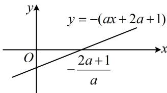

> [!faq]- 《第2节 恒成立问题、多变量问题、求和不等式证明》例题解析
>
> > [!success]- **【答案】** 详见解析
>
> > [!note]- **【分析】**
> > 本题未单列分析。
>
> > [!note]- **【解析】**
> > 解：
> > 所以 $f(x)$ 在 $(-1,0)$ 上单调递减，在 $(0, +\infty)$ 上单调递增，故 $f(x)$ 有极小值 $f(0) = 0$ ，无极大值.
> >
> > 解法2：（按解法1求得 $f'(x)$ 后，若没想到能直接判断它在 $x = 0$ 两侧的正负，也可考虑二次求导）
> > 因为 $f''(x)=\frac{2}{1+x}+\frac{1+x-x}{(1+x)^2}=\frac{3+2x}{(1+x)^2}>0$ ，所以 $f'(x)$ 在 $(-1,+\infty)$ 上单调递增，
> > 又因为 $f'(0)=0$ ，所以当 -1<x<0 时， $f'(x)<0$ ，当 x>0 时， $f'(x)>0$ ，接下来同解法1.
> >
> > 由题意， $f^{\prime}(x) = -a\ln (1 + x) + \frac{1 - ax}{1 + x} -1$ ， $f''(x) = -\frac{a}{1 + x} -\frac{a + 1}{(1 + x)^2} = -\frac{ax + 2a + 1}{(1 + x)^2},$
> >
> > 当 $a \leq -\frac{1}{2}$ 时，对 $\forall x \geq 0$ ， $ax + 2a + 1 \leq -\frac{1}{2}x + 2 \times \left(-\frac{1}{2}\right) + 1 = -\frac{1}{2}x \leq 0$ ，所以 $f''(x) = -\frac{ax + 2a + 1}{(1 + x)^2} \geq 0$
> >
> > 故 $f'(x)$ 在 $[0, +\infty)$ 上单调递增，又 $f'(0) = 0$ ，所以 $f'(x) \geq 0$ ，故 $f(x)$ 在 $[0, +\infty)$ 上单调递增，
> >
> > 结合 $f(0) = 0$ 可得 $f(x)\geq 0$ 在 $[0, + \infty)$ 上恒成立，满足题意；
> >
> > (再看 $a > -\frac{1}{2}$ 的情况, 可以想象此时 $f(x) \geq 0$ 在 $x \geq 0$ 时不能恒成立的原因是 $f''(x)$ 在 $x = 0$ 右侧附近有一段为负, 故抓住这一点来论证即可, 如何论证? 观察发现分析 $f''(x)$ 的正负, 核心是看分子的 $ax + 2a + 1$ , 它在 $[0, +\infty)$ 上的正负情况又受 $a$ 的正负的影响, 故再细分为 $-\frac{1}{2} < a < 0$ 和 $a \geq 0$ 两种情况分别考虑)
> >
> > 当 $-\frac{1}{2} < a < 0$ 时，令 $f''(x) = 0$ 得 $ax + 2a + 1 = 0$ ，解得： $x = -\frac{2a + 1}{a}$ 且 $-\frac{2a + 1}{a} = -2 - \frac{1}{a} >0$ ，所以如图，当 $0\leq x < -\frac{2a + 1}{a}$ 时， $f''(x) < 0$ 所以 $f^{\prime}(x)$ 在 $\left[0, - \frac{2a + 1}{a}\right)$ 上单调递减，
> >
> > 
> >
> > 又因为 $f'(0) = 0$ ，所以当 $x \in \left[0, -\frac{2a + 1}{a}\right)$ 时， $f'(x) < 0$ ，故 $f(x)$ 在 $\left[0, -\frac{2a + 1}{a}\right)$ 上也单调递减，
> >
> > 结合 $f(0) = 0$ 可得当 $x \in \left(0, -\frac{2a + 1}{a}\right)$ 时， $f(x) < 0$ ，所以 $f(x) \geq 0$ 在 $[0, +\infty)$ 上不能恒成立，不合题意；
> >
> > $$
> > a \geq 0
> > $$
> >
> > $$
> > a x + 2 a + 1 \geq 1 > 0
> > $$
> >
> > $$
> > f ^ {\prime \prime} (x) <   0
> > $$
> >
> > $$
> > f ^ {\prime} (0) = 0
> > $$
> >
> > $$
> > f ^ {\prime} (x) \leq 0
> > $$
> >
> > 结合 $f(0) = 0$ 可得 $x > 0$ 时， $f(x) < 0$ ，所以 $f(x) \geq 0$ 在 $[0, +\infty)$ 上不能恒成立，不合题意；
> >
> > 综上所述，实数 $a$ 的取值范围是 $\left(-\infty, -\frac{1}{2}\right]$ .
