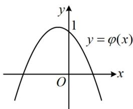
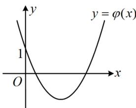
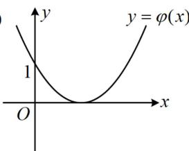
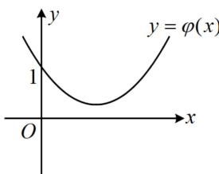
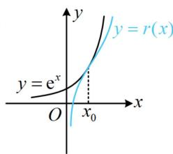
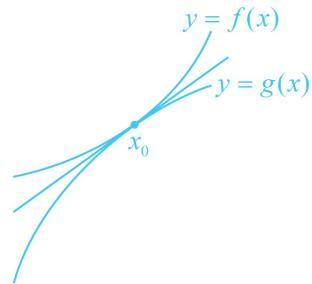

> [!faq]- 《第2节 恒成立问题、多变量问题、求和不等式证明》例题解析
>
> > [!success]- **【答案】** 详见解析
>
> > [!note]- **【分析】**
> > 本题未单列分析。
>
> > [!note]- **【解析】**
> > （3）若 $f(x)\leq \mathrm{e}^{x}$ ，求实数 $a$ 的取值范围.
> >
> > 解：
> > （1）由题意， $f
> > (1) = 2a$ ， $f'(x) = \frac{1}{x} + 2ax - 1$ ， $x > 0$ ，所以 $f' (1) = 2a$ ，
> >
> > 故 $f(x)$ 在 $x = 1$ 处的切线方程为 $y - 2a = 2a(x - 1)$ ，化简得： $y = 2ax$ ，
> >
> > 该直线过原点，所以曲线 $y = f(x)$ 在 x = 1 处的切线过原点.
> >
> > （2）由
> > 故 $f(x)$ 在 $(0,1)$ 上单调递增，在 $(1, +\infty)$ 上单调递减；
> >
> > (当 $a \neq 0$ 时, 分子为二次函数, 可结合二次函数的图象来看, $a$ 的正负影响开口方向, 先讨论 $a$ 的正负) (ii) 当 $a < 0$ 时, 二次函数 $\varphi(x) = 2ax^2 - x + 1$ 的对称轴为 $x = \frac{1}{4a} < 0$ , $\varphi(0) = 1 > 0$ , 所以其大致图象如图 1,
> >
> > 令 $\varphi(x) = 0$ 可得 $x = \frac{1 \pm \sqrt{1 - 8a}}{4a}$ ，因为 $a < 0$ ，所以 $\frac{1 + \sqrt{1 - 8a}}{4a} < 0 < \frac{1 - \sqrt{1 - 8a}}{4a}$ ，
> >
> > 结合图1可知 $f^{\prime}(x) > 0\Leftrightarrow \varphi (x) > 0\Leftrightarrow 0 <   x <   \frac{1 - \sqrt{1 - 8a}}{4a},\quad f^{\prime}(x) <   0\Leftrightarrow x > \frac{1 - \sqrt{1 - 8a}}{4a},$
> >
> > 所以 $f(x)$ 在 $\left(0, \frac{1 - \sqrt{1 - 8a}}{4a}\right)$ 上单调递增，在 $\left(\frac{1 - \sqrt{1 - 8a}}{4a}, +\infty\right)$ 上单调递减；
> >
> > (当 a > 0 时， $\varphi(x)$ 开口向上，对称轴 $x = \frac{1}{4a} > 0$ ，判别式 $\Delta = 1 - 8a$ 正负不同， $\varphi(x)$ 的图象与 x 轴的交点个数也就不同， $\varphi(x)$ 的正负情况随之而改变，有图 2，3，4 三种情况，故又讨论判别式)
> >
> > (iii)当 $0 < a < \frac{1}{8}$ 时， $\Delta = 1 - 8a > 0$ ，令 $\varphi(x) = 0$ 可得 $x = \frac{1 \pm \sqrt{1 - 8a}}{4a}$ ，且 $0 < \frac{1 - \sqrt{1 - 8a}}{4a} < \frac{1 + \sqrt{1 - 8a}}{4a}$ ，
> >
> > 所以 $f^{\prime}(x) > 0\Leftrightarrow 0 <   x <   \frac{1 - \sqrt{1 - 8a}}{4a}$ 或 $x > \frac{1 + \sqrt{1 - 8a}}{4a},\quad f^{\prime}(x) <   0\Leftrightarrow \frac{1 - \sqrt{1 - 8a}}{4a} <  x <   \frac{1 + \sqrt{1 - 8a}}{4a},$
> >
> > 故 $f(x)$ 在 $\left(0, \frac{1 - \sqrt{1 - 8a}}{4a}\right)$ 上单调递增，在 $\left(\frac{1 - \sqrt{1 - 8a}}{4a}, \frac{1 + \sqrt{1 - 8a}}{4a}\right)$ 上单调递减，
> >
> > 在 $\left(\frac{1+\sqrt{1-8a}}{4a},+\infty\right)$ 上单调递增；
> >
> > (iv) 当 $a \geq \frac{1}{8}$ 时， $\varphi(x) = 2ax^2 - x + 1 \geq 2 \times \frac{1}{8}x^2 - x + 1 = \left(\frac{1}{2}x - 1\right)^2 \geq 0$ ，所以 $f'(x) \geq 0$ ，
> >
> > 故 $f(x)$ 在 $(0, +\infty)$ 上单调递增.
> >
> >   
> > 图1
> >
> >   
> > 图2
> >
> >   
> > 图3
> >
> >   
> > 图4
> >
> >   
> > 图5
> >
> > （3）解法1： $(f(x) \leq e^{x} \Leftrightarrow \ln x + ax^{2} - x + a + 1 \leq e^{x} \Leftrightarrow \ln x + a(x^{2} + 1) - x + 1 \leq e^{x}$ ，观察发现参数 $a$ 容易分离出来，但经尝试，分离后得到的函数不易研究，而且这里也没有端点效应，怎么办呢？此时还可尝试画图找思路， $r(x) = \ln x + a(x^{2} + 1) - x + 1$ 的图象怎么画？因为 $a$ 在变，所以我们无法画出它准确的图象，但可以想象，由于 $x^{2} + 1 > 0$ ，所以当 $a$ 增大时， $r(x)$ 图象的运动趋势是往上的，故要使 $r(x) \leq e^{x}$ ，则 $a$ 不能太大，其临界状态大致如图5， $y = r(x)$ 与 $y = e^{x}$ 的图象应相切。下面我们先非正式地求出这一临界状态，以便于做到心中有数。可设切点的横坐标为 $x_{0}$ ，则 $\left\{ \begin{array}{l} \ln x_{0} + a(x_{0}^{2} + 1) - x_{0} + 1 = e^{x_{0}} \\ \frac{1}{x_{0}} + 2ax_{0} - 1 = e^{x_{0}} \end{array} \right.$ ，由②反解出 $a$ 可得 $a = \frac{x_0e^{x_0} + x_0 - 1}{2x_0^2}$ ，代入①得 $\ln x_{0} + \frac{x_{0}e^{x_{0}} + x_{0} - 1}{2x_{0}^{2}} (x_{0}^{2} + 1) - x_{0} + 1 = e^{x_{0}}$ ，此式很复杂，只能猜根，为了让 $\ln x_{0}$ ， $e^{x_{0}}$ 的值简单，可先试试 $x_{0} = 1$ ，经尝试，它就是该方程的根，临界状态就求出来了。正式作答时，可先抓住这个 $x_{0} = 1$ 的关键位置来限定参数 $a$ 的范围）。设 $g(x) = f(x) - e^{x} = \ln x + a(x^{2} + 1) - x + 1 - e^{x}$ ， $x > 0$ ，则由题意， $g(x) \leq 0$ ，所以 $g
> > (1) = 2a - e \leq 0$ ，故 $a \leq \frac{e}{2}$ ，（经过前面大量的分析，我们可猜测 $a \leq \frac{e}{2}$ 很可能就是最终答案，所以接下来尝试证明当 $a \leq \frac{e}{2}$ 时， $g(x) \leq 0$ 恒成立。既然已有参数的范围，那不妨先用它对 $g(x)$ 进行放缩，转化为不含参的不等式来证）。所以 $g(x) = \ln x + a(x^{2} + 1) - x + 1 - e^{x} \leq \ln x + \frac{e}{2}(x^{2} + 1) - x + 1 - e^{x}$ ③，设 $h(x) = \ln x + \frac{e}{2}(x^{2} + 1) - x + 1 - e^{x}$ ， $x > 0$ ，则 $h'(x) = \frac{1}{x} + ex - 1 - e^{x}$ ，（不易直接判断正负，考虑继续求导）。所以 $h''(x) = -\frac{1}{x^2} + e - e^x$ ， $h'''(x) = \frac{2}{x^3} - e^x$ ，由 $y = \frac{2}{x^3}$ 和 $y = -e^x$ 在 $(0, +\infty)$ 上都单调递减可得 $h'''(x)$ 在 $(0, +\infty)$ 上单调递减，又 $h'''\left(\frac{1}{2}\right) = 16 - \sqrt{e} > 0$ ， $h''' (1) = 2 - e < 0$ ，所以 $h'''(x)$ 在 $\left(\frac{1}{2}, 1\right)$ 上有唯一的零点，设该零点为 $x_{1}$ ，则当 $x \in (0, x_{1})$ 时， $h'''(x) > 0$ ，所以 $h''(x)$ 单调递增，当 $x \in (x_{1}, +\infty)$ 时， $h'''(x) < 0$ ，所以 $h''(x)$ 单调递减，故 $h''(x)_{\max} = h''(x_{1}) = -\frac{1}{x_{1}^{2}} + e - e^{x_{1}}$ ④，（ $h''(x_{1})$ 的正负显然不好直接判断，怎么办呢？注意到 $x_{1}$ 是 $h'''(x)$ 的零点，故可考虑用 $h'''(x_{1}) = 0$ 来化简式④再看）。因为 $h'''(x_{1}) = \frac{2}{x_{1}^{3}} - e^{x_{1}} = 0$ ，所以 $e^{x_{1}} = \frac{2}{x_{1}^{3}}$ ，代入④得 $h''(x_{1}) = -\frac{1}{x_{1}^{2}} + e - \frac{2}{x_{1}^{3}} = e - \frac{1}{x_{1}^{2}} - \frac{2}{x_{1}^{3}}$ ，因为 $\frac{1}{2} < x_{1} < 1$ ，所以 $\frac{1}{x_{1}^{2}} + \frac{2}{x_{1}^{3}} > 3$ ，从而 $h''(x_{1}) = e - \frac{1}{x_{1}^{2}} - \frac{2}{x_{1}^{3}} < e - 3 < 0$ ，故 $h''(x) < 0$ 恒成立。所以 $h'(x)$ 在 $(0, +\infty)$ 上单调递减，注意到 $h' (1) = 0$ ，所以当 $x \in (0, 1)$ 时， $h'(x) > 0$ ， $h(x)$ 单调递增，当 $x \in (1, +\infty)$ 时， $h'(x) < 0$ ， $h(x)$ 单调递减，故 $h(x)_{\max} = h (1)$ ，又 $h (1) = 0$ ，所以 $h(x) \leq 0$ 恒成立。由③可知 $g(x) \leq h(x)$ ，所以 $g(x) \leq 0$ ，即 $f(x) - e^x \leq 0$ ，故 $f(x) \leq e^x$ 。综上所述，若 $f(x) \leq e^x$ ，则实数 $a$ 的取值范围是 $\left(-\infty, \frac{e}{2}\right]$ 。
> > 解法2：（解法1得到 $h''(x) = -\frac{1}{x^2} + e - e^x$ 后，采取的是再求三阶导数来证明 $h''(x) < 0$ 恒成立，这一过程较为繁琐，若熟悉次级放缩不等式 $e^x > x^2 + 1 (x > 0)$ ，则可用它来快速证明 $h''(x) < 0$ 这一结果）。设 $p(x) = \frac{x^2 + 1}{e^x}$ ， $x \geq 0$ ，则 $p'(x) = \frac{2xe^x - (x^2 + 1)e^x}{(e^x)^2} = -\frac{(x - 1)^2}{e^x} \leq 0$ ，所以 $p(x)$ 在 $[0, +\infty)$ 上单调递减，又 $p(0) = 1$ ，所以当 $x > 0$ 时， $p(x) < 1$ ，即 $\frac{x^2 + 1}{e^x} < 1$ ，故 $e^x > x^2 + 1$
> >
> > 所以 $h''(x) = -\frac{1}{x^{2}} + e - e^{x} < -\frac{1}{x^{2}} + e - (x^{2} + 1) = e - 1 - \left(\frac{1}{x^{2}} + x^{2}\right) \leq e - 1 - 2\sqrt{\frac{1}{x^{2}} \cdot x^{2}} = e - 3 < 0$ ，接下来同解法 1.
>
> > [!tip]- **【反思】**
> > 在含参不等式恒成立问题中，当参变分离、端点效应都失效时，还可以考虑将原不等式进行适当的拆分，再画图寻找思路。若通过画图分析发现使 $f(x) \geq g(x)$ 恒成立的临界状态恰好是两个函数图象相切（两图象在公共点处有公切线）的情形，如图，则可先在草稿纸上按 $\left\{\begin{aligned}f(x_{0}) &= g(x_{0}) \\ f'(x_{0}) &= g'(x_{0})\end{aligned}\right.$ 求出临界状态，做到心中有数。正式作答时，可先用 $f(x_{0}) \geq g(x_{0})$ 来得出 $f(x) \geq g(x)$ 成立的必要条件，再证明充分性。
> >
> > 
