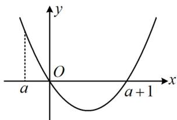
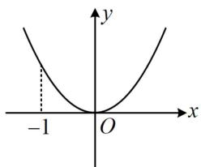
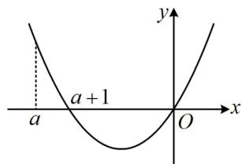
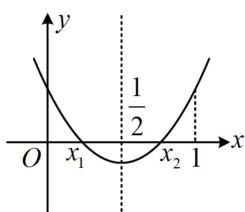

<!-- question-source:start -->
【例4】已知 $f(x) = \frac{1}{2} x^2 - x - a\ln (x - a)$ ， $a \in \mathbf{R}$ .

(1) 判断函数 $f(x)$ 的单调性;

（2）若 $x_{1}$ ， $x_{2}(x_{1} <   x_{2})$ 是 $g(x) = f(x + a) - a\left(x + \frac{1}{2} a - 1\right)$ 的两个极值点，求证： $0 <   f(x_1) - f(x_2) <   \frac{1}{2}.$

（1）由题意， $f(x)$ 的定义域为 $(a, +\infty)$ ， $f'(x) = x - 1 - \frac{a}{x - a} = \frac{(x - 1)(x - a) - a}{x - a} = \frac{x(x - a - 1)}{x - a}$ ，

当 $a \geq 0$ 时，在 $(a, +\infty)$ 上， $x > 0$ 恒成立，所以 $f'(x) > 0 \Leftrightarrow x - a - 1 > 0 \Leftrightarrow x > a + 1$ ， $f'(x) < 0 \Leftrightarrow a < x < a + 1$ ，故 $f(x)$ 在 $(a, a + 1)$ 上单调递减，在 $(a + 1, +\infty)$ 上单调递增；

当 $-1 < a < 0$ 时， $a + 1 > 0$ ，如图1， $f'(x) > 0 \Leftrightarrow x(x - a - 1) > 0 \Leftrightarrow a < x < 0$ 或 $x > a + 1$ ， $f'(x) < 0 \Leftrightarrow 0 < x < a + 1$ ，所以 $f(x)$ 在 $(a,0)$ 上单调递增，在 $(0,a + 1)$ 上单调递减，在 $(a + 1, +\infty)$ 上单调递增；

当 $a = -1$ 时， $a + 1 = 0$ ，如图2， $f'(x) \geq 0$ 在定义域 $(-1, +\infty)$ 上恒成立，所以 $f(x)$ 在 $(-1, +\infty)$ 上单调递增；当 $a < -1$ 时， $a + 1 < 0$ ，如图3， $f'(x) > 0 \Leftrightarrow x(x - a - 1) > 0 \Leftrightarrow a < x < a + 1$ 或 $x > 0$ ， $f'(x) < 0 \Leftrightarrow a + 1 < x < 0$ ，所以 $f(x)$ 在 $(a, a + 1)$ 上单调递增，在 $(a + 1, 0)$ 上单调递减，在 $(0, +\infty)$ 上单调递增.

  
图1

  
图2

  
图3

  
图4

（2）（题干说 $g(x)$ 有两个极值点，应先分析怎样能使 $g(x)$ 有两个极值点，以及两个极值点的分布情况由题意， $g(x) = f(x + a) - a\left(x + \frac{1}{2} a - 1\right) = \frac{1}{2}(x + a)^2 - (x + a) - a\ln (x + a - a) - ax - \frac{1}{2} a^2 + a = \frac{1}{2} x^2 - x - a\ln x$

其中 $x > 0$ ，所以 $g^{\prime}(x) = x - 1 - \frac{a}{x} = \frac{x^{2} - x - a}{x}$
<!-- question-source:end -->

![[高中/总复习/教辅/一数常规版2026/第3章 函数与导数/模块8：导数综合大题/第2节 恒成立问题、多变量问题、求和不等式证明/类型02_多变量问题/例题/answers/Q00050038A1.md]]
