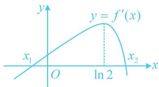

<!-- question-source:start -->
【例5】已知函数 $f(x) = x^{2} + ax - \mathrm{e}^{x}(a\in \mathbf{R})$ 有两个极值点 $x_{1}, x_{2}$ .

(1) 求实数 a 的取值范围;

(2) 证明: $x_{1} + x_{2} < \ln 4$ .

（1）由题意， $f'(x)=2x+a-e^{x}$ ， $f(x)$ 有两个极值点等价于 $f'(x)$ 有两个变号零点，

(分析 $f'(x)$ 的零点，可考虑再求导，研究 $f'(x)$ 的单调性)

$f''(x) = 2 - \mathrm{e}^x$ ，所以 $f''(x) > 0\Leftrightarrow x <   \ln 2$ ， $f''(x) <   0\Leftrightarrow x > \ln 2$

故 $f'(x)$ 在 $(-\infty, \ln 2)$ 上单调递增，在 $(\ln 2, +\infty)$ 上单调递减，

要使 $f'(x)$ 有2个变号零点，应有 $f'(\ln 2) = 2\ln 2 + a - 2 > 0$ ，解得： $a > 2 - 2\ln 2$ ，（需注意， $f'(\ln 2) > 0$ 只是 $f'(x)$ 有2个变号零点的必要条件，要论证充分性，还需取点说明 $\ln 2$ 的两侧确实均有零点。先看左边的点怎么取，注意到 $-\mathrm{e}^x < 0$ ，所以只需让余下的 $2x + a = 0$ ，就能使 $f'(x) < 0$ ，左边的点就取出来了）

(1) = 0$ ，所以 $\mathrm{e}^x - \mathrm{e}x \geq 0$ ，故 $\mathrm{e}^x \geq \mathrm{e}x$ ，所以 $f'(x) = 2x + a - \mathrm{e}^x \leq 2x + a - \mathrm{e}x = a - (\mathrm{e} - 2)x$ ，故当 $x > \frac{a}{\mathrm{e} - 2}$ 时， $f'(x) \leq a - (\mathrm{e} - 2)x < a - (\mathrm{e} - 2) \cdot \frac{a}{\mathrm{e} - 2} = 0$ ，所以 $f'(x)$ 在 $(\ln 2, +\infty)$ 上有一个零点，故 $f'(x)$ 共有两个零点，且它们都是 $f'(x)$ 的变号零点，

此时 $f(x)$ 有2个极值点，故 $\pmb{a}$ 的取值范围是 $(2 - 2\ln 2, + \infty)$

(2) 证法1: (目标不等式涉及 $x_{1}$ , $x_{2}$ 两个变量, 显然它们彼此不独立, 故考虑消元, 怎么消? $x_{1}$ 与 $x_{2}$ 的内在联系是 $f'(x_{1}) = f'(x_{2}) = 0$ , 故考虑用它消元, 怎样将要证的关于自变量的不等式与函数值联系起来? 当然想到单调性, 于是先把目标不等式左右两边化到 $f'(x)$ 的同一个单调区间上, 观察发现移项即可) 不妨设 $x_{1} < x_{2}$ , 则由
(1) 可得 $x_{1} < \ln 2 < x_{2}$ , 要证 $x_{1} + x_{2} < \ln 4$ , 只需证 $x_{2} < \ln 4 - x_{1}$ ①, 由 $x_{1} < \ln 2$ 可得 $\ln 4 - x_{1} > \ln 4 - \ln 2 = \ln 2$ , 结合 $f'(x)$ 在 $(\ln 2, +\infty)$ 上单调递减可知要证①成立, 只需证 $f'(x_{2}) > f'(\ln 4 - x_{1})$ ,

(我们发现产生了 $f'(x_{2})$ , 只要把它替换成 $f'(x_{1})$ , 就实现了消元)

（2）问是典型的极值点偏移问题，有深刻的图形背景. $x_{1} + x_{2} < \ln 4 \Leftrightarrow \frac{x_{1} + x_{2}}{2} < \ln 2$ ，反映到图象上即 $f'(x)$ 在极值点 $x = \ln 2$ 左侧上升缓慢，右侧下降迅速，造成 $f'(x)$ 在极值点两侧的图象不对称，而是向右偏移的，如图，这样的图象与 $x$ 轴的两个交点的中点必定在极值点左侧，所以 $\frac{x_{1} + x_{2}}{2} < \ln 2$ .

极值点偏移问题常有两种解法，一是像证法1那样利用单调性将自变量不等式转化为函数值不等式来证明，再消元构造对称差函数求导分析；二是像证法2那样通过代数变形，再换元化单变量不等式求导证明.有些问题虽然看似不是极值点偏移问题，但其处理方法与极值点偏移问题类似，我们来看一个变式
<!-- question-source:end -->

![[高中/总复习/教辅/一数常规版2026/第3章 函数与导数/模块8：导数综合大题/第2节 恒成立问题、多变量问题、求和不等式证明/类型02_多变量问题/例题/answers/Q00050039A1.md]]
