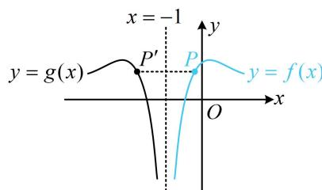

> [!faq]- 《第2节 恒成立问题、多变量问题、求和不等式证明》例题解析
>
> > [!success]- **【答案】** 详见解析
>
> > [!note]- **【分析】**
> > 本题未单列分析。
>
> > [!note]- **【解析】**
> > 解：
> > （1）（怎样理解并应用 $f(x)$ 与 $g(x)$ 的图象关于直线 $x = -1$ 对称这一条件？涉及对称，若无思路，不妨画图来看看）如图，因为 $f(x)$ ， $g(x)$ 的图象关于直线 $x = -1$ 对称，所以 $f(x)$ 图象上任意的点 $P$ 关于 $x = -1$ 的对称点 $P'$ 在 $g(x)$ 的图象上，（所求为 $f(x)$ 的解析式，故可设 $P$ 的坐标为 $(x, y)$ ，并用 $x, y$ 表示出 $P'$ 的坐标，代入 $g(x)$ 的解析式建立起 $x, y$ 的关系）
> >
> > 
> >
> > 设 $P(x,y)$ 为 $f(x)$ 图象上任意一点，则 $P$ 关于 $x = -1$ 对称的点为 $P'(-2 - x,y)$ ，
> >
> > 代入 $g(x)$ 的解析式 $y = 2\ln (-x - 1) + \cos (-x - 2)$ 得 $y = 2\ln [-(-2 - x) - 1] + \cos [-(-2 - x) - 2]$ ，
> >
> > 化简得: $y = 2 \ln (x + 1) + \cos x$ , (这就是 $f(x)$ 的解析式, 但还需给出 $x$ 的范围, 两函数关于 $x = -1$ 对称, 故可先求 $g(x)$ 的定义域, 再把它按 $x = -1$ 对称)
> >
> > 在 $g(x)$ 的解析式中， $-x - 1 > 0$ ，所以 $x < -1$ ，从而 $g(x)$ 的定义域为 $(- \infty, -1)$ ，故 $f(x)$ 的定义域是 $(-1, +\infty)$ ，所以 $f(x) = 2 \ln (x + 1) + \cos x$ ， $x > -1$ 。
> >
> > (2) $f(x) - 1 \leq ax \Leftrightarrow f(x) - 1 - ax \leq 0$ ，设 $h(x) = f(x) - 1 - ax = 2\ln (x + 1) + \cos x - 1 - ax$ ， $x > -1$ ，则 $h(x) \leq 0$
> >
> > （接下来直接求导分析？可以想象，有对数，有三角，又含参，直接求导不好处理，怎么办呢？仔细观察会发现这里刚好有 $h(0) = 0$ ，这意味着 $h(0)$ 是函数 $h(x)$ 的最大值，区间内部的最大值，必定也是极大值，于是有 $h'(0) = 0$ ， $a$ 就求出来了）注意到 $h(0) = 0$ ，所以 $h(0)$ 是 $h(x)$ 的最大值，也是极大值，故 $h'(0) = 0$ 又 $h'(x) = \frac{2}{x + 1} - \sin x - a$ ，所以 $h'(0) = 2 - a = 0$ ，解得： $a = 2$ （结束了吗？务必注意， $h'(0) = 0$ 只是 $h(0)$ 为最大值的必要条件，不是充分条件，故还需检验）当 $a = 2$ 时， $h(x) = 2\ln (x + 1) + \cos x - 1 - 2x$ ，（下面证明 $h(x) \leq 0$ ，经尝试，直接求导不好处理，考虑放缩，如何放缩？观察形式，稍作变形有 $h(x) = 2[\ln (x + 1) - x] + (\cos x - 1)$ ，思路就来了，由经典切线放缩不等式可知 $\ln (x + 1) - x \leq 0$ ，显然 $\cos x - 1 \leq 0$ ，所以 $h(x) \leq 0$ 成立，下面给出详细过程）令 $\varphi(x) = 2[\ln (x + 1) - x]$ ， $x > -1$ ，则 $\varphi'(x) = 2\left(\frac{1}{x + 1} - 1\right) = -\frac{2x}{x + 1}$ ，故 $\varphi'(x) > 0 \Leftrightarrow -1 < x < 0$ ， $\varphi'(x) < 0 \Leftrightarrow x > 0$ ，所以 $\varphi(x)$ 在 $(-1,0)$ 上单调递增，在 $(0,+\infty)$ 上单调递减，故 $\varphi(x) \leq \varphi(0) = 0$ ，即 $2[\ln (x + 1) - x] \leq 0$ 又 $\cos x - 1 \leq 0$ ，所以 $h(x) = 2[\ln (x + 1) - x] + (\cos x - 1) \leq 0 + 0 = 0$ ，满足题意，所以 $a = 2$ 。
> > （3）（函数 $f(x)$ 的解析式较复杂，代解析式计算 $\sum_{k=n+1}^{2n} f\left(\frac{1}{k} - \frac{1}{2}\right)$ ，再证目标不等式显然不可取，考虑放缩，如何放缩？这种题一般都会联系前面的小问，第
> > （2）问的结论表明 $f(x) - 1 \leq 2x$ ，所以 $f(x) \leq 1 + 2x$ ，故 $f\left(\frac{1}{k} - \frac{1}{2}\right) \leq 1 + 2\left(\frac{1}{k} - \frac{1}{2}\right) = \frac{2}{k}$ ，所以 $\sum_{k=n+1}^{2n} f\left(\frac{1}{k} - \frac{1}{2}\right) \leq \sum_{k=n+1}^{2n} \frac{2}{k} = 2\left(\frac{1}{n+1} + \frac{1}{n+2} + \cdots + \frac{1}{2n}\right)$ ①，（所以只需证 $2\left(\frac{1}{n+1} + \frac{1}{n+2} + \cdots + \frac{1}{2n}\right) < \ln 4$ ，观察发现左边的和无法求出，故又考虑放缩成可以求和的结构。注意到右边有对数，于是又联想到第 （2）问用过的经典切线放缩不等式 $\ln (x + 1) \leq x$ ，可以完成对数与分式的转换，故又尝试用它放缩）又由 （2）可知， $\varphi(x) = 2\ln (x + 1) - 2x \leq 0$ 在 $(-1,+\infty)$ 上恒成立，所以 $x \geq \ln (x + 1)$ ②，（我们要证的是 $2\left(\frac{1}{n+1} + \frac{1}{n+2} + \cdots + \frac{1}{2n}\right) < \ln 4$ ，所以需要对数那边更大才对，不等式②的方向好像与此不符，故需调整，怎样调整？两端乘以-1即可）由②可得 $-x \leq -\ln (x + 1)$ 在 $(-1,+\infty)$ 上恒成立，当且仅当 $x = 0$ 时取等号，（为了获得 $\frac{1}{n+1} + \frac{1}{n+2} + \cdots + \frac{1}{2n}$ 这一结构，我们让上述不等式中的 $-x$ 分别等于 $\frac{1}{n+1}$ ， $\frac{1}{n+2}$ ，…， $\frac{1}{2n}$ ，即让 $x$ 分别等于 $-\frac{1}{n+1}$ ， $-\frac{1}{n+2}$ ，…， $-\frac{1}{2n}$ ）在 $-x \leq -\ln (x + 1)$ 中分别取 $x = -\frac{1}{n+1}$ ， $-\frac{1}{n+2}$ ，…， $-\frac{1}{2n}$ 可得 $\begin{cases} \frac{1}{n+1} < -\ln\left(-\frac{1}{n+1} + 1\right) = \ln\frac{n+1}{n} \\ \frac{1}{n+2} < -\ln\left(-\frac{1}{n+2} + 1\right) = \ln\frac{n+2}{n+1}, \\ \cdots \\ \frac{1}{2n} < -\ln\left(-\frac{1}{2n} + 1\right) = \ln\frac{2n}{2n-1} \end{cases}$ 以上各式相加得 $\frac{1}{n+1} + \frac{1}{n+2} + \cdots + \frac{1}{2n} < \ln\frac{n+1}{n} + \ln\frac{n+2}{n+1} + \cdots + \ln\frac{2n}{2n-1} = \ln\left(\frac{n+1}{n} \cdot \frac{n+2}{n+1} \cdots \frac{2n}{2n-1}\right) = \ln 2$ 结合①可知 $\sum_{k=n+1}^{2n} f\left(\frac{1}{k} - \frac{1}{2}\right) \leq 2\left(\frac{1}{n+1} + \frac{1}{n+2} + \cdots + \frac{1}{2n}\right) < 2\ln 2 = \ln 4.$ 【反思】证明 $\sum_{k=n+1}^{2n} f\left(\frac{1}{k} - \frac{1}{2}\right) < \ln 4$ 这种左侧无法求出和的求和不等式时，可考虑通过放缩将左侧化为可求和的形式，再进行证明。有时也会遇到右边不是常数的情况，此时又怎么办呢？我们来看下面的变式。
