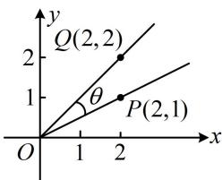

<!-- question-source:start -->
## 5.（2023·福建厦门第二次质检·★★★）

如图， $\cos \left(\theta +\frac{3\pi}{4}\right) =$ （ ）A. $-\frac{2\sqrt{5}}{5}$ B. $-\frac{\sqrt{5}}{5}$ C. $-\frac{4}{5}$ D. $\frac{2\sqrt{5}}{5}$

<!-- question-source:end -->

![[Q00050056A1]]
