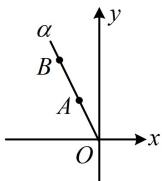

> [!faq]- 《第1节 三角函数的定义》参考答案
>
> > [!success]- **【答案】** A
>
> > [!note]- **【分析】**
> > 本题未单列分析。
>
> > [!note]- **【解析】**
> > (2022·山东潍坊二模·★★☆)
> >
> > 已知角 $\alpha$ 的顶点为坐标原点，始边与 $x$ 轴的非负半轴重合，点 $A(x_{1},2)$ ， $B(x_{2},4)$ 在 $\alpha$ 的终边上，且 $x_{1} - x_{2} = 1$ 则 $\tan \alpha = (\quad)$ A. 2 B. $\frac{1}{2}$ C. -2 D. $-\frac{1}{2}$
> >
> > 解法1：只要求出 $x_{1}$ 或 $x_{2}$ ，就能用三角函数定义求 $\tan \alpha$ 。条件中已经有 $x_{1} - x_{2} = 1$ ，可用 $A, B$ 的坐标把 $\tan \alpha$ 表示出来，再建立一个 $x_{1}$ 和 $x_{2}$ 的方程，求解 $x_{1}$ 或 $x_{2}$ ，由题意， $\tan \alpha = \frac{2}{x_1}, \tan \alpha = \frac{4}{x_2}$ ，所以 $\frac{2}{x_1} = \frac{4}{x_2}$ ，故 $x_{2} = 2x_{1}$ ，代入 $x_{1} - x_{2} = 1$ 可得 $x_{1} = -1$ ，故 $\tan \alpha = \frac{2}{x_1} = -2$ 。解法2：题干给出 $A, B$ 两点的坐标，以及 $x_{1} - x_{2} = 1$ ，想到两点连线的斜率公式，于是先画图看看，如图， $\tan \alpha$ 等于直线 $AB$ 的斜率，所以 $\tan \alpha = \frac{2 - 4}{x_1 - x_2} = \frac{-2}{x_1 - x_2}$ ，又 $x_{1} - x_{2} = 1$ ，所以 $\tan \alpha = -2$ 。
> >
> > 
