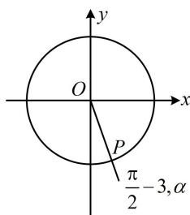

> [!faq]- 《第1节 三角函数的定义》参考答案
>
> > [!success]- **【答案】** C
>
> > [!note]- **【分析】**
> > 本题未单列分析。
>
> > [!note]- **【解析】**
> > C
> >
> > 解析：给出终边上一点，先把三角函数的定义式写出来，
> >
> > 因为 $\sin^2 3 + \cos^2 3 = 1$ ，所以点 $P$ 在单位圆上，
> >
> > 故 $\cos \alpha = \sin 3$ ， $\sin \alpha = \cos 3$
> >
> > 要求的是 $\alpha$ ，可考虑把右侧的函数名化为与左侧一致，从而找到 $\alpha$ 的终边，再化到 $[0,2\pi]$ 上即可选答案，
> >
> > 因为 $\sin 3 = \cos \left(\frac{\pi}{2} - 3\right)$ , $\cos 3 = \sin \left(\frac{\pi}{2} - 3\right)$ ,
> >
> > 所以 $\cos\alpha=\cos\left(\frac{\pi}{2}-3\right)$ ， $\sin\alpha=\sin\left(\frac{\pi}{2}-3\right)$ ，
> >
> > 故 $\alpha$ 与 $\frac{\pi}{2} - 3$ 有相同的终边，如图，所以 $\alpha = \frac{\pi}{2} - 3 + 2k\pi$
> >
> > 其中 $k \in Z$ ，因为 $0 \leq \alpha \leq 2\pi$ ，所以 k = 1， $\alpha = \frac{5\pi}{2} - 3$ .
> >
> > 
> >
> > 一数·必刷100讲
