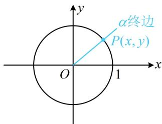
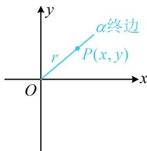
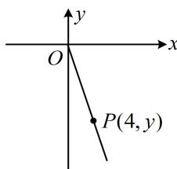
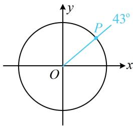
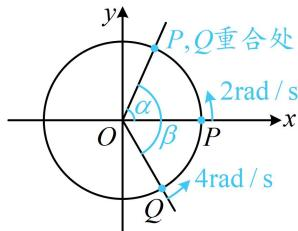

<!-- source-part:1 pages:1-4 -->

# 模块一 同角三角函数关系与诱导公式

# 第1节 三角函数的定义（★☆）

内容提要

若题干给出角的终边上某点的坐标，或给出角的终边所在直线的方程，考虑用三角函数定义求三角函数值，有下面两种等价的定义方法：

1. 如图 1, 设 $P(x, y)$ 为角 $\alpha$ 终边与单位圆的交点, 则 $\sin \alpha = y$ , $\cos \alpha = x$ , $\tan \alpha = \frac{y}{x} (x \neq 0)$ .

2. 如图 2，设 $P(x, y)$ 为角 $\alpha$ 终边上一点， $r = |OP| = \sqrt{x^2 + y^2}$ ，则 $\sin \alpha = \frac{y}{r}$ ， $\cos \alpha = \frac{x}{r}$ ， $\tan \alpha = \frac{y}{x} (x \neq 0)$ .

  
图1

  
图2

【例 1】角 $\theta$ 的顶点为坐标原点，始边为 x 轴的非负半轴，若 $P(4, y)$ 是角 $\theta$ 终边上一点，且 $\sin \theta = -\frac{2\sqrt{5}}{5}$ ，则 y = \_\_\_\_.

解析：给出角 $\theta$ 终边上的一点，想到用三角函数的定义求出 $\sin \theta$ ，结合已知建立关于 $y$ 的方程，

如图， $\sin \theta = \frac{y}{|OP|} = \frac{y}{\sqrt{16 + y^2}}$ ，又 $\sin \theta = -\frac{2\sqrt{5}}{5}$ ，所以 $\frac{y}{\sqrt{16 + y^2}} = -\frac{2\sqrt{5}}{5}$

由上式可看出 $y < 0$ ，平方后可求得 $y = -8$ .

答案：-8

【变式】已知角 $\alpha$ 的终边经过点 $P(\sin 47^{\circ},\cos 47^{\circ})$ ，则 $\sin (\alpha -13^{\circ}) =$ （ ）A. $\frac{1}{2}$ B. $\frac{\sqrt{3}}{2}$ C. $-\frac{1}{2}$ D. $-\frac{\sqrt{3}}{2}$

解法1：给出角终边上的一点的坐标，联想到三角函数的定义，先用定义计算 $\sin \alpha$ 和 $\cos \alpha$

因为 $|OP| = \sqrt{\sin^2 47^\circ + \cos^2 47^\circ} = 1$ ，所以 $P$ 是 $\alpha$ 的终边与单位圆的交点，故 $\sin \alpha = \cos 47^\circ$ ， $\cos \alpha = \sin 47^\circ$ ，所以 $\sin (\alpha - 13^\circ) = \sin \alpha \cos 13^\circ - \cos \alpha \sin 13^\circ = \cos 47^\circ \cos 13^\circ - \sin 47^\circ \sin 13^\circ = \cos (47^\circ + 13^\circ) = \cos 60^\circ = \frac{1}{2}$ .

解法2：观察发现 $P$ 的坐标为三角形式，若能化为三角函数定义的格式 $P(\cos \alpha, \sin \alpha)$ ，则可直接求出 $\alpha$ ，因为 $\sin 47^{\circ} = \sin (90^{\circ} - 43^{\circ}) = \cos 43^{\circ}$ ， $\cos 47^{\circ} = \cos (90^{\circ} - 43^{\circ}) = \sin 43^{\circ}$ ，

所以点 $P$ 的坐标可化为 $(\cos 43^{\circ}, \sin 43^{\circ})$ ，如图，结合三角函数定义可得 $\alpha$ 的终边与 $43^{\circ}$ 的终边重合，从而 $\alpha = k \cdot 360^{\circ} + 43^{\circ} (k \in \mathbf{Z})$ ，故 $\sin (\alpha - 13^{\circ}) = \sin (k \cdot 360^{\circ} + 43^{\circ} - 13^{\circ}) = \sin 30^{\circ} = \frac{1}{2}$ .

答案: A

【反思】①当终边上的点的坐标是三角形式时，应先将其化为 $(\cos \alpha, \sin \alpha)$ 这种标准格式，才能用三角函数的定义；②已知终边位置时，需注意终边相同的角可以相差 $2k\pi (k \in \mathbf{Z})$ 。

【例2】质点 $P$ 和 $Q$ 在以坐标原点 $O$ 为圆心, 1 为半径的圆 $O$ 上逆时针作匀速圆周运动, 同时出发. $P$ 的角速度大小为 $2 \mathrm{rad} / \mathrm{s}$ , 起点为圆 $O$ 与 $x$ 轴正半轴的交点, $Q$ 的角速度大小为 $4 \mathrm{rad} / \mathrm{s}$ , 起点为射线 $y = -\sqrt{3} x (x \geq 0)$ 与圆 $O$ 的交点, 则当 $P$ 与 $Q$ 重合时, $Q$ 的坐标为 \_\_\_\_.

解析： $P$ ， $Q$ 重合即射线 $OP$ 与 $OQ$ 重合，可看成角的终边重合，先把以 $OP$ ， $OQ$ 为终边的角写出来，

设在时刻 $t$ （单位：s），以 $OP$ ， $OQ$ 为终边的角分别为 $\alpha$ ， $\beta$ ，则 $\alpha = 2t$

如图，射线 $y = -\sqrt{3} x (x \geq 0)$ 可看成角 $-\frac{\pi}{3}$ 的终边，所以 $\beta = -\frac{\pi}{3} + 4t$ ①，

从而当 $P$ 与 $Q$ 重合时，应有 $\beta = \alpha + 2k\pi (k \in \mathbf{Z})$

即 $-\frac{\pi}{3} + 4t = 2t + 2k\pi$ ，故 $t = k\pi + \frac{\pi}{6}$ ，代入①得： $\beta = -\frac{\pi}{3} + 4k\pi + \frac{2\pi}{3} = 4k\pi + \frac{\pi}{3}$ ，

点 $Q$ 即为 $\beta$ 的终边与单位圆的交点, 可用三角函数定义求其坐标,

所以 $x_{Q} = \cos \beta = \cos \left(4k\pi +\frac{\pi}{3}\right) = \cos \frac{\pi}{3} = \frac{1}{2},\quad y_{Q} = \sin \left(4k\pi +\frac{\pi}{3}\right) = \sin \frac{\pi}{3} = \frac{\sqrt{3}}{2}$ ，故点 $Q$ 的坐标为 $\left(\frac{1}{2},\frac{\sqrt{3}}{2}\right)$ 答案： $\left(\frac{1}{2},\frac{\sqrt{3}}{2}\right)$

![[高中/总复习/教辅/一数常规版2026/第4章 三角函数/模块1：同角三角函数关系与诱导公式/第1节 三角函数的定义/强化训练/强化训练.md]]
