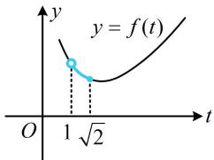

> [!faq]- 《第2节 同角三角函数基本关系》参考答案
>
> > [!success]- **【答案】** $\frac{5\sqrt{2}}{4}$
>
> > [!note]- **【分析】**
> > 本题未单列分析。
>
> > [!note]- **【解析】**
> > 解析：看到 $\sin x + \cos x$ 和 $\sin x \cos x$ 出现在一个式子里，想到将 $\sin x + \cos x$ 换元成 t，通过平方把 $\sin x \cos x$ 也用 t 表示，设 $t = \sin x + \cos x$ ，则 $t = \sqrt{2} \sin \left( x + \frac{\pi}{4} \right)$ ，当 $x \in \left(0, \frac{\pi}{2}\right)$ 时，
> >
> > $x + \frac{\pi}{4}\in \left(\frac{\pi}{4},\frac{3\pi}{4}\right)$ ，所以 $1 < t = \sqrt{2}\sin \left(x + \frac{\pi}{4}\right)\leq \sqrt{2}$
> >
> > $$
> > t ^ {2} = (\sin x + \cos x) ^ {2} = \sin^ {2} x + \cos^ {2} x + 2 \sin x \cos x
> > $$
> >
> > $= 1 + 2\sin x\cos x$ ，所以 $\sin x\cos x = \frac{t^2 - 1}{2}$
> >
> > 故 $a(\sin x + \cos x) \leq 2 + \sin x\cos x$ 即为 $at \leq 2 + \frac{t^2 - 1}{2}$ ,
> >
> > 也即 $a \leq \frac{1}{2}\left(t + \frac{3}{t}\right)$ ，如图， $f(t) = \frac{1}{2}\left(t + \frac{3}{t}\right)$ 在 $(1, \sqrt{2}]$ 上 $\searrow$ ，
> >
> > 所以 $f(t)_{\min} = f(\sqrt{2}) = \frac{5\sqrt{2}}{4}$ ，因为 $a \leq f(t)$ 恒成立，
> >
> > 所以 $a \leq \frac{5\sqrt{2}}{4}$ ，故 $a$ 的最大值为 $\frac{5\sqrt{2}}{4}$
> >
> > 
> >
> > 一数·必刷100讲
