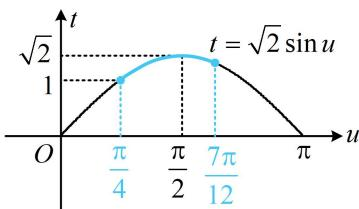

> [!faq]- 《第2节 同角三角函数基本关系》例题解析
>
> > [!success]- **【答案】** A
>
> > [!note]- **【分析】**
> > 本题未单列分析。
>
> > [!note]- **【解析】**
> > A. 1 B. $\sqrt{2}$ C. 2 D. $\sqrt{2} + 1$
> >
> > 解析：由于 $(\sin x + \cos x)^2 = 1 + 2\sin x\cos x$ ，所以可将 $\sin x + \cos x$ 换元，转化为二次函数求区间最值，
> >
> > 设 $t = \sin x + \cos x$ ，则 $t = \sqrt{2}\sin \left(x + \frac{\pi}{4}\right)$ ，换元后，应研究新元的取值范围，设 $u = x + \frac{\pi}{4}$ ，则 $t = \sqrt{2}\sin u$ ，当 $x\in \left[0,\frac{\pi}{3}\right]$ 时， $u = x + \frac{\pi}{4}\in \left[\frac{\pi}{4},\frac{7\pi}{12}\right]$ 函数 $t = \sqrt{2}\sin u$ 的部分图象如图所示，由图可知 $t\in [1,\sqrt{2} ]$
> >
> > 
> >
> > 又 $t^2 = (\sin x + \cos x)^2 = 1 + 2\sin x\cos x$ ，所以 $2\sin x\cos x = t^2 -1$
> >
> > 故 $y = t - (t^2 - 1) = -t^2 + t + 1$ ，因为二次函数 $y = -t^2 + t + 1$ 在 $[1, \sqrt{2}]$ 上 $\searrow$ ，
> >
> > 所以当 $t = 1$ 时， $y$ 取得最大值1.
>
> > [!tip]- **【反思】**
> > 看到 $\sin x \pm \cos x$ 和 $\sin x \cos x$ 出现在一个式子中，想到将 $\sin x \pm \cos x$ 换元成 $t$ ，并通过将其平方来把 $\sin x \cos x$ 也用 $t$ 表示.
