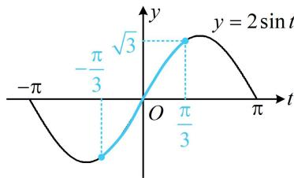

> [!faq]- 《第1节 和差角、辅助角、二倍角、积化和差与和差化积公式》例题解析
>
> > [!success]- **【答案】** $\sqrt{3}$
>
> > [!note]- **【分析】**
> > 本题未单列分析。
>
> > [!note]- **【解析】**
> > 解析：由辅助角公式， $f(x)=\sqrt{1^{2}+(-\sqrt{3})^{2}}\sin(x+\varphi)=2\sin(x+\varphi)$ ，这里规定了 $0\leq x\leq\frac{2\pi}{3}$ ，故必须求出 $\varphi$ ，因为 $\tan\varphi=-\sqrt{3}$ 且 $\varphi\in\left(-\frac{\pi}{2},\frac{\pi}{2}\right)$ ，所以 $\varphi=-\frac{\pi}{3}$ ，故 $f(x)=2\sin\left(x-\frac{\pi}{3}\right)$ ，
> >
> > 接下来可将 $x - \frac{\pi}{3}$ 换元成 $t$ ，借助 $y = 2\sin t$ 的图象来求最值，
> >
> > 设 $t = x - \frac{\pi}{3}$ ，则 $f(x) = 2\sin t$ ，当 $0\leq x\leq \frac{2\pi}{3}$ 时， $-\frac{\pi}{3}\leq t = x - \frac{\pi}{3}\leq \frac{\pi}{3},$
> >
> > 函数 $y = 2\sin t$ 的部分图象如图所示，
> >
> > 
> >
> > 由图可知当 $t = \frac{\pi}{3}$ 时， $f(x)$ 取得最大值 $\sqrt{3}$ .
