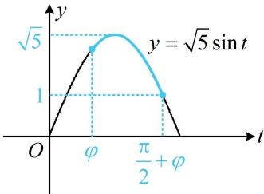

> [!faq]- 《第1节 和差角、辅助角、二倍角、积化和差与和差化积公式》例题解析
>
> > [!success]- **【答案】** $[1,\sqrt{5} ]$
>
> > [!note]- **【分析】**
> > 本题未单列分析。
>
> > [!note]- **【解析】**
> > 解析：由辅助角公式， $f(x) = \sqrt{1^2 + 2^2}\sin (x + \varphi) = \sqrt{5}\sin (x + \varphi)$ ，为了求值域，可先将 $x + \varphi$ 换元成 $t$ ，
> >
> > 设 $t = x + \varphi$ ，则 $f(x) = \sqrt{5}\sin t$ ，因为 $0\leq x\leq \frac{\pi}{2}$ ，所以 $\varphi \leq t\leq \frac{\pi}{2} +\varphi$
> >
> > 接下来必须研究辅助角 $\varphi$ ，才能求出 $y = \sqrt{5} \sin t$ 在 $\left[\varphi, \frac{\pi}{2} + \varphi\right]$ 上的值域，
> >
> > 由辅助角公式知 $\sin \varphi = \frac{2\sqrt{5}}{5}$ ， $\cos \varphi = \frac{\sqrt{5}}{5}$ ，所以 $\varphi$ 在第一象限，不妨设 $\varphi \in \left(0, \frac{\pi}{2}\right)$ ，
> >
> > 从而 $y = \sqrt{5}\sin t$ 在 $\left[\varphi ,\frac{\pi}{2}\right]$ 上，在 $\left[\frac{\pi}{2},\frac{\pi}{2} +\varphi \right]$ 上，故当 $t = \frac{\pi}{2}$ 时， $f(x)$ 取得最大值 $\sqrt{5}$
> >
> > 对于最小值，根据单调性，只需比较左右端点谁更小即可，
> >
> > 又 $\sin \varphi = \frac{2\sqrt{5}}{5} >\sin \left(\frac{\pi}{2} +\varphi\right) = \cos \varphi = \frac{\sqrt{5}}{5},$
> >
> > 所以 $y = \sqrt{5}\sin t$ 在 $\left[\varphi ,\frac{\pi}{2} +\varphi \right]$ 上的图象如图所示，
> >
> > 由图可知，当 $t = \frac{\pi}{2} +\varphi$ 时， $f(x)$ 取得最小值1，故 $f(x)$ 的值域为 $[1,\sqrt{5} ]$
> >
> > 
>
> > [!tip]- **【反思】**
> > 在辅助角公式 $a \sin x + b \cos x = \sqrt{a^2 + b^2} \sin (x + \varphi)$ 中，若需要用到辅助角 $\varphi$ ，但 $\varphi$ 又不是特殊角，则我们可以利用 $\cos \varphi = \frac{a}{\sqrt{a^2 + b^2}}$ ， $\sin \varphi = \frac{b}{\sqrt{a^2 + b^2}}$ 来解决问题.
