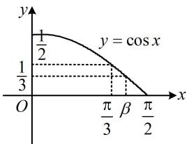

> [!faq]- 《第2节 三大统一思想：角度、名称、次数》参考答案
>
> > [!success]- **【答案】** A
>
> > [!note]- **【分析】**
> > 本题未单列分析。
>
> > [!note]- **【解析】**
> > A
> > 解析：给值求值问题，先将求值的角统一成已知的角，为了便于观察，将 $\alpha + 2\beta$ 换元成 $\gamma$ ，
> > 令 $\gamma = \alpha + 2\beta$ ，则 $\alpha = \gamma - 2\beta$ ，所以 $\alpha + \beta = \gamma - \beta$ ，
> > 且 $\sin \gamma = \frac{1}{5}, \cos \beta = \frac{1}{3}$ ，而 $\sin (\alpha + \beta) = \sin (\gamma - \beta) = \sin \gamma \cos \beta - \cos \gamma \sin \beta = \frac{1}{5} \times \frac{1}{3} - \cos \gamma \sin \beta = \frac{1}{15} - \cos \gamma \sin \beta$ ①，
> > 还差 $\cos \gamma$ 和 $\sin \beta$ ，需先研究角的范围，才能判断其正负，
> > 因为 $\alpha$ ， $\beta$ 为锐角，所以 $\sin \beta = \sqrt{1 - \cos^2 \beta} = \frac{2\sqrt{2}}{3}$ ，且 $\gamma = \alpha + 2\beta \in \left(0, \frac{3\pi}{2}\right)$ ，又 $\sin \gamma = \frac{1}{5} > 0$ ，故 $\gamma \in (0, \pi)$ ②，
> > 此范围仍无法确定 $\cos \gamma$ 的正负，需更精确地分析 $\gamma$ 的范围， $\gamma$ 的范围由 $\alpha$ 和 $\beta$ 决定，可结合 $\cos \beta = \frac{1}{3}$ 给出 $\beta$ 更准确的范围，从而将 $\gamma$ 范围精确化，
> > 因为 $\cos \beta = \frac{1}{3} < \frac{1}{2} = \cos \frac{\pi}{3}$ ，且函数 $y = \cos x$ 在 $\left(0, \frac{\pi}{2}\right) \searrow$ ，
> > 如图，所以 $\frac{\pi}{3} < \beta < \frac{\pi}{2}$ ，故 $\frac{2\pi}{3} < 2\beta < \pi$ ，
> > 又 $0 < \alpha < \frac{\pi}{2}$ ，所以 $\frac{2\pi}{3} < \gamma = \alpha + 2\beta < \frac{3\pi}{2}$ ，结合②可得 $\gamma \in \left(\frac{2\pi}{3}, \pi\right)$ ，所以 $\cos \gamma = -\sqrt{1 - \sin^2 \gamma} = -\frac{2\sqrt{6}}{5}$ ，代入式①得 $\sin (\alpha + \beta) = \frac{1}{15} - \left(-\frac{2\sqrt{6}}{5}\right) \times \frac{2\sqrt{2}}{3} = \frac{1 + 8\sqrt{3}}{15}$ .
> >
> > 
>
> > [!tip]- **【反思】**
> > 类型Ⅱ的四道题对角的范围限定越来越严格，当粗略分析得出某角 $\gamma$ 所在的象限不足以判断 $\sin \gamma$ 或 $\cos \gamma$ 的正负时，应结合有关的三角函数值进一步将范围估计得更准确.
> >
> > ## 类型III：具体角三角函数式化简求值
