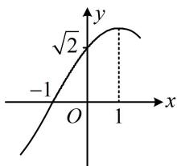

<!-- question-source:start -->
## 4. (2023·海南模拟·★★★)

函数 $f(x) = A\cos (\omega x + \varphi)\left(A > 0, \omega > 0, |\varphi| < \frac{\pi}{2}\right)$ 的部分图象如图所示，则 $f\left(\frac{7}{3}\right) =$ （）A. $\frac{1}{2}$ B. $\frac{\sqrt{2}}{2}$ C. $\frac{\sqrt{3}}{3}$ D. 1

<!-- question-source:end -->

![[Q00050136A1]]
