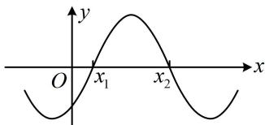

<!-- question-source:start -->
5. (2023·湖北武汉二调·★★★☆)

已知函数 $f(x) = A\sin (\omega x + \varphi)$ 的部分图象如图所示，其中 $A > 0$ ， $\omega > 0$ ， $-\frac{\pi}{2} < \varphi < 0$ 。在已知 $\frac{x_2}{x_1}$ 的条件下，则下列选项中可以确定其值的量为（）A. ω B. φC. $\frac{\varphi}{\omega}$ D. $A\sin \varphi$

<!-- question-source:end -->

![[Q00050137A1]]
