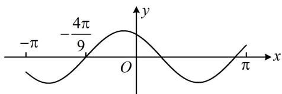

<!-- question-source:start -->
## 6.（2020·新课标Ⅰ卷·★★★☆）

设 $f(x) = \cos \left(\omega x + \frac{\pi}{6}\right)$ 在 $[- \pi, \pi]$ 的图象大致如下图，则 $f(x)$ 的最小正周期为（）A. $\frac{10\pi}{9}$ B. $\frac{7\pi}{6}$ C. $\frac{4\pi}{3}$ D. $\frac{3\pi}{2}$ 一数·必刷100讲

<!-- question-source:end -->

![[Q00050138A1]]
