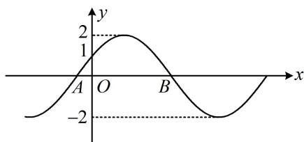

<!-- question-source:start -->
## 7. (2022·福建福州模拟·★★★☆)

如图， $A$ ， $B$ 是 $f(x) = 2\sin (\omega x + \varphi)\left(\omega >0,|\varphi | <   \frac{\pi}{2}\right)$ 的图象与 $x$ 轴的两个交点，若 $\vert OB\vert -\vert OA\vert = \frac{4\pi}{3}$ ，则 $\omega = ()$ A.1 B. $\frac{1}{2}$ C.2 D. $\frac{2}{3}$

<!-- question-source:end -->

![[Q00050139A1]]
