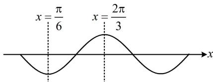

> [!faq]- 《第1节 求三角函数解析式f(x)=Asin(ωx+φ)+B》参考答案
>
> > [!success]- **【答案】** D
>
> > [!note]- **【分析】**
> > 本题未单列分析。
>
> > [!note]- **【解析】**
> > D
> >
> > 解析：条件中有两条对称轴，以及它们之间的单调性，由此容易画出大致图象，故考虑画图来分析，如图， $\frac{2\pi}{3} -\frac{\pi}{6} = \frac{T}{2}\Rightarrow T = \pi$ ，所以 $|\omega | = \frac{2\pi}{T} = 2\Rightarrow \omega = \pm 2$
> >
> > 同上题一样， $\omega$ 取哪个值均可，得到的解析式都可用诱导公式化为相同，不妨取 $\omega=2$ ，则 $f(x)=\sin(2x+\varphi)$ ，再求 $\varphi$ ，代一个最值点即可，
> > 由图可知， $f\left(\frac{\pi}{6}\right)=\sin\left(2\times\frac{\pi}{6}+\varphi\right)=\sin\left(\frac{\pi}{3}+\varphi\right)=-1$ 所以 $\frac{\pi}{3}+\varphi=2k\pi-\frac{\pi}{2}$ ，从而 $\varphi=2k\pi-\frac{5\pi}{6}(k\in\mathbf{Z})$ 故 $f(x)=\sin\left(2x+2k\pi-\frac{5\pi}{6}\right)=\sin\left(2x-\frac{5\pi}{6}\right)$ ,
> > 所以 $f\left(-\frac{5\pi}{12}\right)=\sin\left[2\times\left(-\frac{5\pi}{12}\right)-\frac{5\pi}{6}\right]$ $=\sin\left(-\frac{5\pi}{3}\right)=\sin\frac{\pi}{3}=\frac{\sqrt{3}}{2}$
> >
> > 
