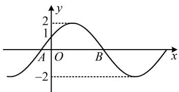
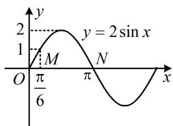

> [!faq]- 《第1节 求三角函数解析式f(x)=Asin(ωx+φ)+B》参考答案
>
> > [!success]- **【答案】** B
>
> > [!note]- **【分析】**
> > 本题未单列分析。
>
> > [!note]- **【解析】**
> > 解法1: 图象上横纵坐标都已知的点只有(0,1)这一个, 先把它代入解析式, 求得 $\varphi$ ,
> >
> > 由图可知， $f(0) = 2\sin \varphi = 1$ ，所以 $\sin \varphi = \frac{1}{2}$
> >
> > 又 $\left|\varphi\right|<\frac{\pi}{2}$ ，所以 $\varphi=\frac{\pi}{6}$ ，故 $f(x)=2\sin\left(\omega x+\frac{\pi}{6}\right)$ ，
> >
> > 接下来求 $\omega$ ， $|OB| - |OA| = \frac{4\pi}{3}$ 这个条件肯定要用，所以我们求出 $A$ ， $B$ 的横坐标来表示 $|OB|$ 和 $|OA|$
> >
> > 令 $f(x) = 0$ 可得 $\sin \left(\omega x + \frac{\pi}{6}\right) = 0$ ，所以 $\omega x + \frac{\pi}{6} = k\pi$
> >
> > 故 $x = \frac{1}{\omega}\left(k\pi -\frac{\pi}{6}\right)(k\in \mathbf{Z})$
> >
> > 从图象来看，点 $A$ 处是 $f(x)$ 从 $y$ 轴往左边的第一个零点，必定为 $k = 0$ 的情形，
> >
> > 令 $k = 0$ 得： $x = -\frac{\pi}{6\omega}$ ，所以 $x_{A} = -\frac{\pi}{6\omega}$
> >
> > 点 $B$ 处是 $f(x)$ 从 $y$ 轴往右边的第一个零点，必为 $k = 1$ 的
> >
> > 情形，令 $k = 1$ 得： $x = \frac{5\pi}{6\omega}$ ，所以 $x_{B} = \frac{5\pi}{6\omega}$
> >
> > 从而 $\left|OA\right|=\frac{\pi}{6\omega}$ ， $\left|OB\right|=\frac{5\pi}{6\omega}$ ，故 $\left|OB\right|-\left|OA\right|=\frac{5\pi}{6\omega}-\frac{\pi}{6\omega}$
> >
> > $= \frac{2\pi}{3\omega}$ ，由题意， $\frac{2\pi}{3\omega} = \frac{4\pi}{3}$ ，解得： $\omega = \frac{1}{2}$
> >
> > 解法2： $f(x)$ 的图象可由 $y = 2\sin x$ 横向平移和伸缩得来， $y = 2\sin x$ 的图象如图2，横向平移和伸缩不会改变水平方向上的线段长度比例，所以图1中 $\frac{|OA|}{|OB|}$ 与图2中 $\frac{|OM|}{|MN|}$ 相等，由图2可知， $\frac{|OM|}{|MN|} = \frac{\frac{\pi}{6} - 0}{\pi - \frac{\pi}{6}} = \frac{1}{5}$ ，所以 $\frac{|OA|}{|OB|} = \frac{1}{5}$ ，结合 $|OB| - |OA| = \frac{4\pi}{3}$ 可得 $|OA| = \frac{\pi}{3}$ ， $|OB| = \frac{5\pi}{3}$ ，所以 $|AB| = |OA| + |OB| = 2\pi$ ，由图1可知 $|AB| = \frac{T}{2}$ ，其中 $T$ 为 $f(x)$ 的最小正周期，
> >
> > 所以 $\frac{T}{2} = 2\pi$ ，从而 $T = 4\pi$ ，故 $\omega = \frac{2\pi}{T} = \frac{1}{2}$
> >
> >   
> > 图1
> >
> >   
> > 图2
