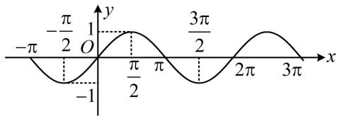
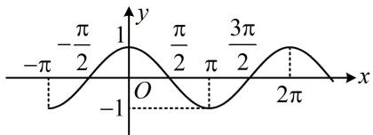
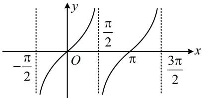
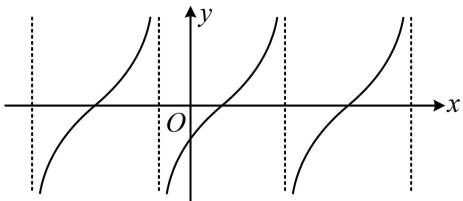

<!-- source-part:1 pages:1-8 -->

# 模块三 三角函数的图象性质

## 第1节 求三角函数解析式 $f(x) = A\sin (\omega x + \varphi) + B$ （★★★）

## 内容提要

求三角函数解析式 $f(x) = A\sin (\omega x + \varphi) + B$ 的常见题型有恒等变换化简、根据图象求解析式等.

1. 恒等变换化简得到 $f(x) = A\sin (\omega x + \varphi) + B$ ：一般分“拆”、“降”、“合”三步.

①拆：若解析式中有 $\cos \left(2x - \frac{\pi}{6}\right)$ 这类结构，通常先拆开；

②降：遇到 $\sin^2 x$ ， $\cos^2 x$ ， $\sin x\cos x$ ，可降次；（“拆”和“降”的顺序要视情况而定）

③合：完成前两步后，通常就化为了 $f(x) = a\sin \omega x + b\cos \omega x + B$ 这类结构，最后可利用辅助角公式合并.

2. 根据图象求解析式 $f(x) = A\sin (\omega x + \varphi) + B$ :

①用最大值和最小值求 $A$ ： $\left\{ \begin{array}{l}f(x)_{\max} = |A| + B\\ f(x)_{\min} = -|A| + B \end{array} \right.\Rightarrow \left|A\right| = \frac{f(x)_{\max} - f(x)_{\min}}{2};$

②用最大值和最小值求 $B$ ： $\left\{ \begin{array}{l}f(x)_{\max} = |A| + B\\ f(x)_{\min} = -|A| + B \end{array} \right.\Rightarrow B = \frac{f(x)_{\max} + f(x)_{\min}}{2};$

③用最小正周期 $T$ 求 $\omega: |\omega| = \frac{2\pi}{T}$ ;

④最值点求 $\varphi$ ：将函数图象上的最大值或最小值点代入解析式，求出 $\varphi$ ．若图象上没有标最值点，也无法通过简单的推理得出最值点，则考虑代其它已知点求 $\varphi$ ．之所以首选最值点，是因为一个周期内，只有最大值或最小值点是唯一的，若代其它点，可能会有增根需要舍去.

3. $y = \sin x$ 和 $y = \cos x$ 的图象及性质

<table><tr><td>函数</td><td>y=sin x</td><td>y=cos x</td></tr><tr><td>图象</td><td></td><td></td></tr><tr><td>定义域</td><td>R</td><td>R</td></tr><tr><td>值域</td><td>[-1,1]</td><td>[-1,1]</td></tr><tr><td>周期性</td><td>最小正周期为2π</td><td>最小正周期为2π</td></tr><tr><td>奇偶性</td><td>奇函数</td><td>偶函数</td></tr><tr><td>单调性最值</td><td>单调递增区间: [2kπ-π/2,2kπ+π/2](k∈Z)单调递减区间: [2kπ+π/2,2kπ+3π/2](k∈Z)当 $x = {2k\pi } + \frac{\pi }{2}\left( {k \in  \mathbf{Z}}\right)$ 时,  ${y}_{\max } = 1$  当  $x = {2k\pi } - \frac{\pi }{2}\left( {k \in  \mathbf{Z}}\right)$  时,  ${y}_{\min } =  - 1$ </td><td>单调递增区间: [2kπ-π,2kπ](k∈Z)单调递减区间: [2kπ,2kπ+π](k∈Z)当  $x = {2k\pi }\left( {k \in  \mathbf{Z}}\right)$  时,  ${y}_{\max } = 1$  当  $x = {2k\pi } + \pi \left( {k \in  \mathbf{Z}}\right)$  时,  ${y}_{\min } =  - 1$ </td></tr><tr><td>对称轴</td><td> $x = {k\pi } + \frac{\pi }{2}\left( {k \in  \mathbf{Z}}\right)$ </td><td> $x = {k\pi }\left( {k \in  \mathbf{Z}}\right)$ </td></tr><tr><td>对称中心</td><td> $\left( {{k\pi },0}\right) \left( {k \in  \mathbf{Z}}\right)$ </td><td> $\left( {{k\pi } + \frac{\pi }{2},0}\right) \left( {k \in  \mathbf{Z}}\right)$ </td></tr></table>

4. $y = \tan x$ 的图象及性质

<table><tr><td>函数</td><td>y=tan x</td><td>y=A tan(ωx+φ)(A&gt;0,ω&gt;0)</td></tr><tr><td>图象</td><td></td><td></td></tr><tr><td>定义域</td><td>{x|x≠kπ+π/2,k∈Z}</td><td>{x|ωx+φ≠kπ+π/2,k∈Z}</td></tr><tr><td>值域</td><td>R</td><td>R</td></tr><tr><td>最小正周期</td><td>π</td><td>π/ω</td></tr><tr><td>奇偶性</td><td>奇函数</td><td>当φ=kπ/2(k∈Z)时为奇函数,否则为非奇非偶函数</td></tr><tr><td>增区间</td><td>(kπ-π/2,kπ+π/2)(k∈Z)</td><td>(1/ω(kπ-π/2-φ),1/ω(kπ+π/2-φ))(k∈Z)</td></tr><tr><td>对称中心</td><td>(kπ/2,0)(k∈Z)</td><td>(1/ω(kπ/2-φ),0)(k∈Z)</td></tr></table>

5. 设 $A > 0$ ， $\omega > 0$ ，则函数 $y = A\sin (\omega x + \varphi)$ 和 $y = A\cos (\omega x + \varphi)$ 的性质如下表：

<table><tr><td>函数</td><td>y = Asin(ωx + φ)</td><td>y = Acos(ωx + φ)</td></tr><tr><td>定义域</td><td>R</td><td>R</td></tr><tr><td>值域</td><td>[-A, A]</td><td>[-A, A]</td></tr><tr><td>周期性</td><td>最小正周期为 2π/ω</td><td>最小正周期为 2π/ω</td></tr><tr><td>单调性</td><td>增区间: 2kπ - π/2 ≤ ωx + φ ≤ 2kπ + π/2 (k ∈ Z)减区间: 2kπ + π/2 ≤ ωx + φ ≤ 2kπ + π/2 (k ∈ Z)</td><td>增区间: 2kπ - π ≤ ωx + φ ≤ 2kπ (k ∈ Z)减区间: 2kπ ≤ ωx + φ ≤ 2kπ + π (k ∈ Z)</td></tr><tr><td>最值</td><td>当 ωx + φ = 2kπ + π/2 (k ∈ Z) 时, ymax = A当 ωx + φ = 2kπ - π/2 (k ∈ Z) 时, ymin = -A</td><td>当 ωx + φ = 2kπ (k ∈ Z) 时, ymax = A当 ωx + φ = 2kπ + π (k ∈ Z) 时, ymin = -A</td></tr><tr><td>对称轴</td><td>ωx + φ = kπ + π/2 (k ∈ Z)</td><td>ωx + φ = kπ (k ∈ Z)</td></tr><tr><td>对称中心</td><td>(1/ω(kπ - φ),0)(k ∈ Z)</td><td>(1/ω(kπ + π/2 - φ),0)(k ∈ Z)</td></tr></table>

![[高中/总复习/教辅/一数常规版2026/第4章 三角函数/模块3：三角函数的图象性质/第1节 求三角函数解析式f(x)=Asin(ωx+φ)+B/类型01_化简求解析式/类型01_化简求解析式.md]]
![[高中/总复习/教辅/一数常规版2026/第4章 三角函数/模块3：三角函数的图象性质/第1节 求三角函数解析式f(x)=Asin(ωx+φ)+B/类型02_由部分图象求解析式/类型02_由部分图象求解析式.md]]
![[高中/总复习/教辅/一数常规版2026/第4章 三角函数/模块3：三角函数的图象性质/第1节 求三角函数解析式f(x)=Asin(ωx+φ)+B/类型03_由伸缩比例求周期/类型03_由伸缩比例求周期.md]]
![[高中/总复习/教辅/一数常规版2026/第4章 三角函数/模块3：三角函数的图象性质/第1节 求三角函数解析式f(x)=Asin(ωx+φ)+B/强化训练/强化训练.md]]
