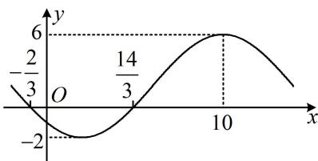

<!-- question-source:start -->
【变式1】已知函数 $f(x) = A \sin (\omega x + \varphi) + B \left( \omega > 0, \left| \varphi \right| < \frac{\pi}{2} \right)$ 的部分图象如图所示，则（）A. $f(x) = -4 \sin \left( \frac{\pi}{8} x + \frac{\pi}{4} \right) + 2$ B. $f(x) = 4 \sin \left( \frac{\pi}{8} x - \frac{\pi}{4} \right) + 2$ C. $f(x) = -4 \sin \left( \frac{\pi}{8} x - \frac{\pi}{4} \right) + 2$ D. $f(x) = 4 \sin \left( \frac{\pi}{8} x + \frac{\pi}{4} \right) + 2$

<!-- question-source:end -->

![[高中/总复习/教辅/一数常规版2026/第4章 三角函数/模块3：三角函数的图象性质/第1节 求三角函数解析式f(x)=Asin(ωx+φ)+B/类型02_由部分图象求解析式/例题/answers/Q00050130A1.md]]
