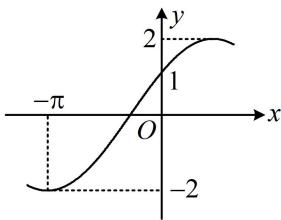

<!-- question-source:start -->
【变式2】下图是函数 $f(x) = A\sin (\omega x + \varphi)\left(A > 0, \omega > 0, |\varphi| < \frac{\pi}{2}\right)$ 的部分图象，则 $f\left(\frac{3\pi}{4}\right) =$ \_\_\_\_.

<!-- question-source:end -->

![[高中/总复习/教辅/一数常规版2026/第4章 三角函数/模块3：三角函数的图象性质/第1节 求三角函数解析式f(x)=Asin(ωx+φ)+B/类型02_由部分图象求解析式/例题/answers/Q00050131A1.md]]
