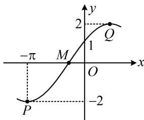

> [!faq]- 《第1节 求三角函数解析式f(x)=Asin(ωx+φ)+B》例题解析
>
> > [!success]- **【答案】** $\sqrt{3}$
>
> > [!note]- **【分析】**
> > 本题未单列分析。
>
> > [!note]- **【解析】**
> > 解析：图中标注了最大、最小值，可由此求 $A$ 由图可知， $f(x)_{\max} = 2$ ，结合 $A > 0$ 可得 $A = 2$
> >
> > 接下来一般的想法是由图上的关键点（最值点、零点）求周期，但本题的关键点只有一个最小值点，也无法推断其它关键点，所以求不出周期，故只能尝试把图中标出的 $(- \pi, -2)$ 和 $(0,1)$ 这两个点代进解析式，由图可知， $\left\{ \begin{array}{l} f(-\pi) = 2 \sin (-\omega \pi + \varphi) = -2 \\ f(0) = 2 \sin \varphi = 1 \end{array} \right.$ ①，我们发现式②是关于 $\varphi$ 的单变量方程，可先求出 $\varphi$ ，由②可得 $\sin \varphi = \frac{1}{2}$ ，结合 $|\varphi| < \frac{\pi}{2}$ 可得 $\varphi = \frac{\pi}{6}$ ，代入①化简得： $\sin \left(-\omega \pi + \frac{\pi}{6}\right) = -1$ ，所以 $-\omega \pi + \frac{\pi}{6} = 2k\pi - \frac{\pi}{2}$ ，故 $\omega = \frac{2}{3} - 2k (k \in \mathbf{Z})$ ，
> >
> > 要求 $\omega$ ，还需筛选 $k$ ，怎么办呢？由图虽无法看出周期，但能看出周期的范围，进而得到 $\omega$ 的范围，如图， $P$ ， $M$ 两点的横向距离是 $\frac{T}{4}$ ，此距离小于点 $P$ 到 $y$ 轴的距离 $\pi$ ，所以 $\frac{T}{4} < \pi$ ，故 $T < 4\pi$ ，又 $P$ ， $Q$ 两点的横向距离为 $\frac{T}{2}$ ，此距离大于点 $P$ 到 $y$ 轴的距离，所以 $\frac{T}{2} > \pi$ ，故 $T > 2\pi$ ，
> >
> > 所以 $2\pi < T < 4\pi$ ，从而 $2\pi < \frac{2\pi}{\omega} < 4\pi$ ，故 $\frac{1}{2} < \omega < 1$
> >
> > 结合 $\omega = \frac{2}{3} - 2k$ 可得 $k$ 只能取0，此时 $\omega = \frac{2}{3}$ ，
> >
> > 所以 $f(x) = 2\sin \left(\frac{2}{3} x + \frac{\pi}{6}\right)$ ，故 $f\left(\frac{3\pi}{4}\right) = 2\sin \left(\frac{2}{3} \times \frac{3\pi}{4} + \frac{\pi}{6}\right) = 2\sin \frac{2\pi}{3} = \sqrt{3}$ .
> >
> > 
>
> > [!tip]- **【反思】**
> > 当无法从图上直接观察或推断出周期时，可以考虑利用最值点、零点这些关键点的横向距离构造不等式限定周期的范围，从而得出 $\omega$ 的范围.
