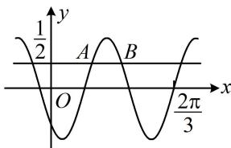

<!-- question-source:start -->
【例 3】(2023·新课标Ⅱ卷) 已知函数 $f(x) = \sin (\omega x + \varphi)$ ，如图， $A, B$ 是直线 $y = \frac{1}{2}$ 与曲线 $y = f(x)$ 的两个交点，若 $|AB| = \frac{\pi}{6}$ ，则 $f(\pi) =$ \_\_\_\_.

<!-- question-source:end -->

![[高中/总复习/教辅/一数常规版2026/第4章 三角函数/模块3：三角函数的图象性质/第1节 求三角函数解析式f(x)=Asin(ωx+φ)+B/类型03_由伸缩比例求周期/例题/answers/Q00050132A1.md]]
