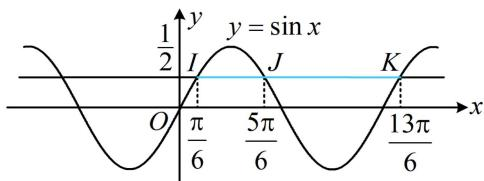
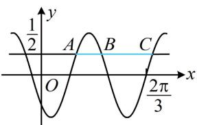

> [!faq]- 《第1节 求三角函数解析式f(x)=Asin(ωx+φ)+B》例题解析
>
> > [!success]- **【答案】** $-\frac{\sqrt{3}}{2}$
>
> > [!note]- **【分析】**
> > 本题未单列分析。
>
> > [!note]- **【解析】**
> > 解法1：条件 $|AB|=\frac{\pi}{6}$ 怎么翻译？可由 $\sin(\omega x+\varphi)=\frac{1}{2}$ 求A，B横坐标的通解，得到 $|AB|$ ，建立方程求 $\omega$ ，不妨设 $\omega>0$ ，令 $\sin(\omega x+\varphi)=\frac{1}{2}$ 可得 $\omega x+\varphi=2k\pi+\frac{\pi}{6}$ 或 $2k\pi+\frac{5\pi}{6}$ ，其中 $k\in Z$ ，
> >
> > 由所给图象可知， $\omega x_{A} + \varphi = 2k\pi +\frac{\pi}{6}$ ， $\omega x_{B} + \varphi = 2k\pi +\frac{5\pi}{6}$ ，将上述两式作差得： $\omega (x_B - x_A) = \frac{2\pi}{3}$
> >
> > 所以 $x_{B} - x_{A} = \frac{2\pi}{3\omega}$ ，又 $\left|AB\right| = x_{B} - x_{A} = \frac{\pi}{6}$ ，所以 $\frac{2\pi}{3\omega} = \frac{\pi}{6}$ ，解得： $\omega = 4$ ，故 $f(x) = \sin (4x + \varphi)$
> >
> > 再求 $\varphi$ ，由所给图象知 $\frac{2\pi}{3}$ 是零点，可代入解析式。注意， $\frac{2\pi}{3}$ 是增区间上的零点，且 $y = \sin x$ 的增区间上的零点是 $2n\pi$ ，故应按它来求 $\varphi$ 的通解，所以 $\frac{8\pi}{3} + \varphi = 2n\pi (n \in \mathbf{Z})$ ，从而 $\varphi = 2n\pi - \frac{8\pi}{3}$ ，
> >
> > 故 $f(x) = \sin \left(4x + 2n\pi -\frac{8\pi}{3}\right) = \sin \left(4x - \frac{2\pi}{3}\right)$ ，所以 $f(\pi) = \sin \left(4\pi -\frac{2\pi}{3}\right) = \sin \left(-\frac{2\pi}{3}\right) = -\sin \frac{2\pi}{3} = -\frac{\sqrt{3}}{2}.$
> >
> > 解法2: 若注意到横向伸缩虽会改变图象在水平方向上的线段长度, 但不改变长度比例, 则可先分析 $y = \sin x$ 与 $y = \frac{1}{2}$ 交点的情况, 再按比例对应到本题的图中来,
> >
> > 如图1，直线 $y = \frac{1}{2}$ 与 $y = \sin x$ 在 $y$ 轴右侧的三个交点 $I, J, K$ 的横坐标分别为 $\frac{\pi}{6}, \frac{5\pi}{6}, \frac{13\pi}{6}$ ，所以 $|IJ| = \frac{5\pi}{6} - \frac{\pi}{6} = \frac{2\pi}{3}$ ， $|JK| = \frac{13\pi}{6} - \frac{5\pi}{6} = \frac{4\pi}{3}$ ， $|IJ|: |JK| = 1:2$ ，故在图2中 $|AB|: |BC| = 1:2$ ，
> >
> > 因为 $|AB| = \frac{\pi}{6}$ ，所以 $|BC| = \frac{\pi}{3}$ ，故 $|AC| = |AB| + |BC| = \frac{\pi}{2}$ ，又由图2可知 $|AC| = T$ ，所以 $T = \frac{\pi}{2}$ ，
> >
> > 故 $\omega = \frac{2\pi}{T} = 4$ ，接下来同解法1.
> >
> >
> >   
> > 图1
> >
> >   
> > 图2
>
> > [!tip]- **【反思】**
> > - **①**：对于函数 $y = \sin (\omega x + \varphi)(\omega > 0)$ ，若只能用零点来求解析式，则需尽量确定零点是在增区间还是减区间。增区间的零点用 $\omega x + \varphi = 2n\pi$ 来求，减区间的零点用 $\omega x + \varphi = 2n\pi + \pi$ 来求；
> > - **②**：对图象进行横向伸缩时，水平方向的线段长度比例关系不变，当涉及水平线与图象交点的距离时，我们常抓住这一特征来求周期。
