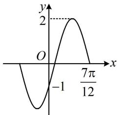

<!-- question-source:start -->
9. (2024·广东惠州二调·★★★☆) (多选)

函数 $f(x) = A\sin (\omega x + \varphi)\left(A > 0, \omega > 0, |\varphi| < \frac{\pi}{2}\right)$ 的部分图象如图所示，现将 $f(x)$ 的图象向左平移 $\frac{\pi}{6}$ 个单位长度，得到函数 $g(x)$ 的图象，则下列结论正确的是（）

A. $\varphi = -\frac{\pi}{6}$

B. $\omega = 2$

C. 函数 $y = xf\left(x + \frac{\pi}{12}\right)$ 是奇函数

D. $g(x) = 2\cos \left(2x - \frac{\pi}{3}\right)$

一数·必刷100讲
<!-- question-source:end -->

![[Q00050154A1]]
