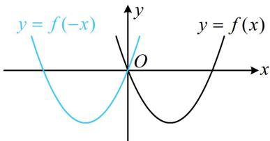
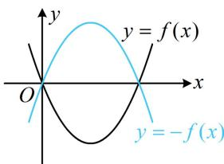

> [!faq]- 《第2节 三角函数图象的变换》例题解析
>
> > [!success]- **【答案】** B
>
> > [!note]- **【分析】**
> > 本题未单列分析。
>
> > [!note]- **【解析】**
> > 解析：先求出 $g(x)$ 的解析式，由题意， $g(x) = f\left(x + \frac{2\pi}{9}\right) = \sin \left[3\left(x + \frac{2\pi}{9}\right) + \varphi\right] = \sin \left(3x + \frac{2\pi}{3} + \varphi\right)$ ，因为 $f(x)$ 与 $g(x)$ 的图象关于 $y$ 轴对称，所以 $g(x) = f(-x)$ ，故 $\sin \left(3x + \frac{2\pi}{3} + \varphi\right) = \sin (-3x + \varphi)$ ①，上式中 $x$ 的系数相反，先把系数化为相同，且保持函数名不变，可用诱导公式 $\sin \alpha = \sin (\pi - \alpha)$ 实现，因为 $\sin (-3x + \varphi) = \sin [\pi - (-3x + \varphi)] = \sin (3x + \pi - \varphi)$ ，所以代入①得 $\sin \left(3x + \frac{2\pi}{3} + \varphi\right) = \sin (3x + \pi - \varphi)$ ，像 $\sin (\omega x + \varphi_1) = \sin (\omega x + \varphi_2)(\omega \neq 0)$ 这种等式要恒成立， $\varphi_1$ 和 $\varphi_2$ 之间一定相差的是 $2\pi$ 的整数倍，所以 $\left(\frac{2\pi}{3} + \varphi\right) - (\pi - \varphi) = 2k\pi$ ，故 $\varphi = k\pi + \frac{\pi}{6} (k \in \mathbf{Z})$ ，又 $|\varphi| < \frac{\pi}{2}$ ，所以 $\varphi = \frac{\pi}{6}$ .
>
> > [!tip]- **【总结】**
> > - **①**：将 $f(x)$ 的图象沿 $y$ 轴翻折，得到的是 $f(-x)$ 图象，故 $f(x)$ 和 $f(-x)$ 关于 $y$ 轴对称，如图1；
> > - **②**：将 $f(x)$ 的图象沿 $x$ 轴翻折，得到的是 $-f(x)$ 的图象，所以 $f(x)$ 和 $-f(x)$ 关于 $x$ 轴对称，如图2.
> >
> >   
> > 图1
> >
> >   
> > 图2
