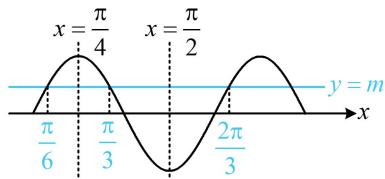

> [!faq]- 《第3节 四个常见条件的翻译》参考答案
>
> > [!success]- **【答案】** 4
>
> > [!note]- **【分析】**
> > 本题未单列分析。
>
> > [!note]- **【解析】**
> > 解析：水平线与 $f(x)$ 图象的相邻两个交点的中间必为对称轴，故由已知可得到2条对称轴，从而推断出周期，求出 $\omega$ 如图，由题意， $x = \frac{\pi}{4}$ 和 $x = \frac{\pi}{2}$ 是相邻的两条对称轴，
> >
> > 所以 $\frac{T}{2} = \frac{\pi}{2} -\frac{\pi}{4} = \frac{\pi}{4}\Rightarrow T = \frac{\pi}{2}\Rightarrow \omega = \frac{2\pi}{T} = 4.$
> >
> > 
