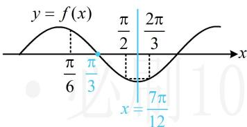

> [!faq]- 《第3节 四个常见条件的翻译》参考答案
>
> > [!success]- **【答案】** $2\sin \left(x + \frac{\pi}{3}\right)$
>
> > [!note]- **【分析】**
> > 本题未单列分析。
>
> > [!note]- **【解析】**
> > 解析：由内容提要1，因为 $f(x)$ 在 $\left[\frac{\pi}{6},\frac{\pi}{2}\right]$ 上单调递减，所以 $\frac{T}{2} \geq \frac{\pi}{2} - \frac{\pi}{6}$ ，故 $T \geq \frac{2\pi}{3}$ ，条件中有 $f\left(\frac{\pi}{2}\right) = -f\left(\frac{\pi}{6}\right)$ ，且给了 $f(x)$ 在 $\left[\frac{\pi}{6}, \frac{\pi}{2}\right]$ 上单调，可由此推断对称中心，如图， $\left(\frac{\pi}{3}, 0\right)$ 必为函数 $f(x)$ 图象的一个对称中心，还剩 $f\left(\frac{\pi}{2}\right) = f\left(\frac{2\pi}{3}\right)$ 这个条件，可由它推断对称轴，如图， $\left[\frac{\pi}{2}, \frac{2\pi}{3}\right]$ 的宽度小于一个周期，所以 $x = \frac{7\pi}{12}$ 为 $f(x)$ 图象的一条对称轴，由图可知 $\frac{T}{4} = \frac{7\pi}{12} - \frac{\pi}{3}$ ，所以 $T = \pi$ ， $\omega = \frac{2\pi}{T} = 2$ ，故 $f(x) = 2\sin(2x + \varphi)$ ，还需求 $\varphi$ ，可代最小值点 $x = \frac{7\pi}{12}$ ， $f\left(\frac{7\pi}{12}\right) = 2\sin\left(2 \times \frac{7\pi}{12} + \varphi\right) = -2$ ，所以 $\sin\left(\frac{7\pi}{6} + \varphi\right) = -1$ ，又 $|\varphi| < \frac{\pi}{2}$ ，所以 $-\frac{\pi}{2} < \varphi < \frac{\pi}{2}$ ，从而 $\frac{2\pi}{3} < \frac{7\pi}{6} + \varphi < \frac{5\pi}{3}$ ，故 $\frac{7\pi}{6} + \varphi = \frac{3\pi}{2}$ ，解得： $\varphi = \frac{\pi}{3}$ ，所以 $f(x) = 2\sin\left(2x + \frac{\pi}{3}\right)$ ，由题意， $g(x) = f\left(\frac{x}{2}\right) = 2\sin\left(x + \frac{\pi}{3}\right)$ .
> >
> > 
